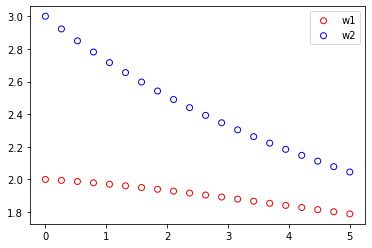
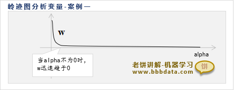
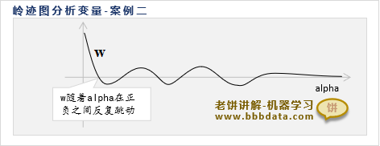
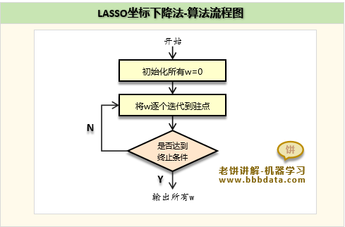
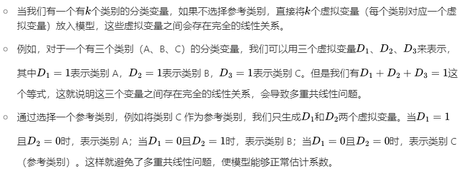
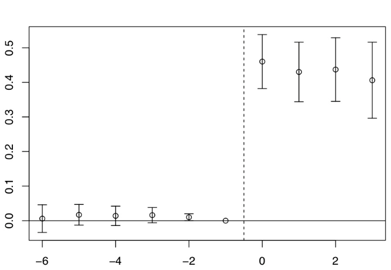
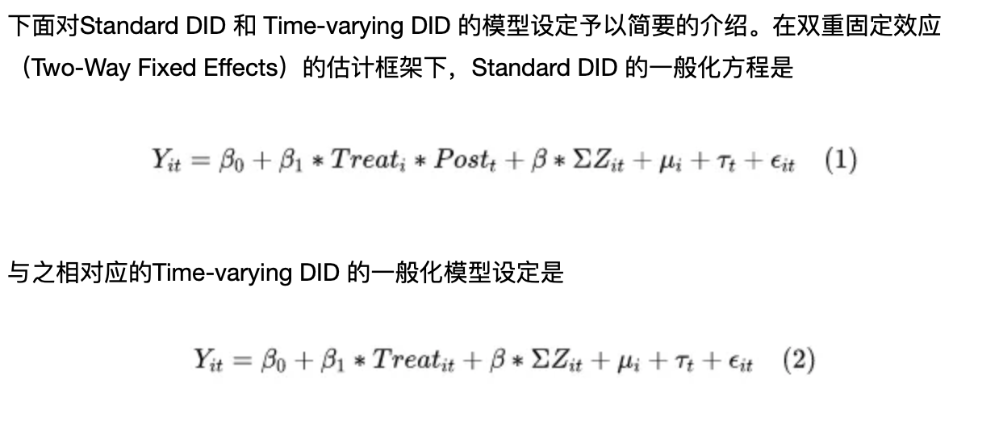
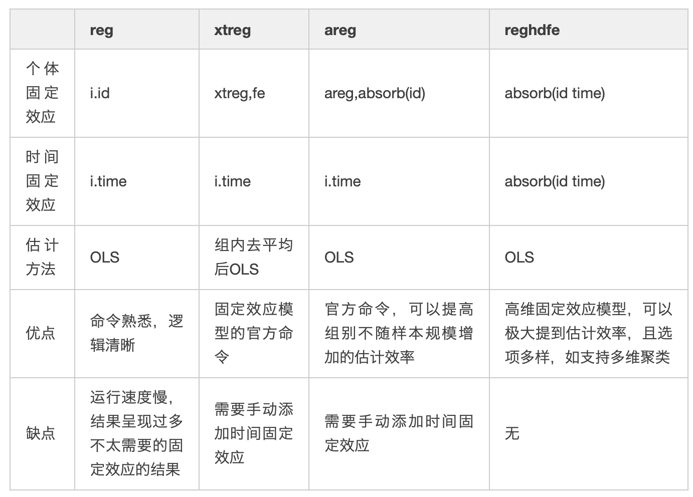

<!-- <style>
@page {
    size: A4;
    margin: 20mm;
}
body {
    font-family: Arial, sans-serif;
    font-size: 14pt; /* 调整全局字体大小 */
    line-height: 1.5;
}
</style> -->

<div align="center" style="font-size:23px;">The empirical method of economic research and stata code</div>

在做任何分析之前都要做协变量平衡分析，防止由于对照组和控制组变量分布造成的误差。

- [1.Random Experiment](#1random-experiment)
- [2.OLS](#2ols)
  - [1. **OLS回归** ](#1-ols回归-)
  - [2. **加权回归** ](#2-加权回归-)
  - [3. **广义最小二乘** ](#3-广义最小二乘-)
  - [4. **迭代加权最小二乘方法（不要求）** ](#4-迭代加权最小二乘方法不要求-)
  - [5. **岭回归** ](#5-岭回归-)
  - [5. **Lasso回归** ](#5-lasso回归-)
- [3.Limit dependent varible](#3limit-dependent-varible)
  - [1. **Logit模型** ](#1-logit模型-)
  - [2. **Probit模型**  ](#2-probit模型--)
  - [3. **泊松分布**](#3-泊松分布)
  - [4. **负二项回归**](#4-负二项回归)
  - [5. **零膨胀**](#5-零膨胀)
  - [6. **截尾回归**](#6-截尾回归)
  - [7. **Tobit模型**  ](#7-tobit模型--)
  - [8. **拟合优度**](#8-拟合优度)
- [4.Matching](#4matching)
  - [1. **精确匹配** ](#1-精确匹配-)
  - [2. **模糊匹配**](#2-模糊匹配)
  - [3. **倾向得分匹配PSM** ](#3-倾向得分匹配psm-)
- [5.Instrument Variable](#5instrument-variable)
  - [**1.弱工具变量检验**](#1弱工具变量检验)
  - [**2.外生性（排除性）检验**](#2外生性排除性检验)
  - [**3.过度识别检验**](#3过度识别检验)
- [6.Panel Data](#6panel-data)
  - [**1.固定效应**](#1固定效应)
- [7.DID](#7did)
  - [**1.平行趋势假定（无法直接检验）**](#1平行趋势假定无法直接检验)
  - [**2.不满足平行趋势假定的解决方法**](#2不满足平行趋势假定的解决方法)
  - [**3.DID的扩展**](#3did的扩展)
- [9.RDD](#9rdd)
- [10.CIC](#10cic)
- [11.SCM](#11scm)
- [实用小代码stata](#实用小代码stata)
- [一些方法](#一些方法)
- [一些知识](#一些知识)

<div style="page-break-after: always;"></div>

## <div style="font-size:25px;text-align:center;">1.Random Experiment</div>

1. 在进行因果估计之前为了避免存在样本分布问题，或者选择性问题，通常会对对照组和样本组进行随机化分析，即计算对照组和实验组具有近似的样本分布。这样可以表示条件独立性。

    ```stata
    // 随机实验验证 对于分组进行验证 检查子组内的平衡
    gen subgroup = group(变量) // 生成分组变量   这个公式会生成一个新的变量，这个变量是根据原来的变量进行取分组值的
    bysort subgroup: summarize(变量) // 按照分组变量进行分组，然后对变量进行描述性统计 因为产生的太快了，需要一个变量一个变量跑 ，然后j子组内对照组和实验组进行对比
    ```

    - **分组求回归等公式**

    ```stata
    // 分组求回归等公式
    bys subgroup: logit/reg y x
    ```

2. 异方差和同方差的检查

   ```stata
   reg price rm crim //首先普通回归，看其残差图的分布推知误差，因为残差基本包含误差。
   rvfplot  //绘制残差图
   ```

3. 多重共线性检验

   ```stata
    reg y x controls //将面板数据当成截面数据做回归
    estat vif //方差膨胀因子 ，VIF最大不超过10，严格来说不应高于5
   ```

<div style="page-break-after: always;"></div>

## <div style="font-size:25px;text-align:center;">2.OLS</div>

***误差项和残差项的是不同的，误差项就在那里，但是分布不知道，但是残差项则是根据你估计的好坏变化。***
>异方差指的是误差，由于误差项不确定，所以假设对于每一个i都有一个分布，由$\beta$的推导知异方差的影响，从回归分布图也可以看出来，同方差的分布相对于回归线是均匀的，但是异方差不均匀。（误差由于截距的存在，均值为0）

### <div style="font-size:20px;">1. **OLS回归** </div>

在进行ols回归时，为了保证ols估计无偏，满足条件，需要保证其是线性的。***利用作图***

```stata
reg y x1 x2 x3//robust 异方差情况
```

### <div style="font-size:20px;">2. **加权回归** </div>

由于不同方差的存在，直观上来说，对不同方差的数据进行相同加权是不合理的，***大方差加小权***。其中一个方法：用方差的倒数进行最小残差加权。
$$
\hat\mu= \arg \mathop{\min}\limits_{\mu} \sum_1^n \frac{(y-\mu)^2}{\sigma^2}
$$

```stata
reg y x1 x2 x3 [aweight = weight] //加权回归
```

此时ols是无偏的，但不是BLUE的。加权ols很好解决这一点。
***由于需要确切的知道误差的方差，这在现实中是不可能的，所以一般使用自己的加权，或者使用robust***

### <div style="font-size:20px;">3. **广义最小二乘** </div>
***当误差的方差已知（需要预测方差的形式）***，那么根据思想:
模型$y=x\beta+\epsilon$ 两边乘$\Sigma^{\frac{-1}{2}}$ 
以下是将该式子翻译为LaTeX代码的结果：
$$
y^* \triangleq \Sigma^{-1/2}y = \Sigma^{-1/2}X\beta + \Sigma^{-1/2}\varepsilon \triangleq X^*\beta + \varepsilon^*, \quad \varepsilon^* \sim (0, I_{n})
$$
已知该模型满足GM假设，则误差项的误差平方和为 
$$\Vert y^*-x^*\beta \Vert = (y-x\beta)^T\Sigma^{-1}(y-x\beta)$$ 
则其最优BLUE的估计$\hat{\beta}_{GLS}=(x^{*T}x^*)^{-1}x^{*T}y=(x^T\Sigma^{-1}x)^{-1}x^T\Sigma^{-1}y$
这就是广义最小二乘估计。

```stata
reg price rm crim
gen lny_resid = log(resid^2) //产生残差平方和对数的变量（为了线性回归回归）
reg lny_resid rm crim //进行残差回归，估计残差的具体形式
predict lnh, xb  //线性预测残差
gen var_pred = exp(lnh)  //预测的恢复 这里预测方差的形式
gls price rm crim, weights(var_pred)//GLS回归，使用var_pred为权重
```

### <div style="font-size:20px;">4. **迭代加权最小二乘方法（不要求）** </div>
若方差是较为复杂项，其中的方差也有参数需要求解，那么方法就是迭代加权。即固定$\theta$然后运用GLS，然后固定$\beta$，残差求解$\theta$
$$
Q(\theta,\beta)=(y-x\beta)^T\Sigma^{-1}(\theta)(y-x\beta)+log|\Sigma(\theta)|
$$

### <div style="font-size:20px;">5. **岭回归** </div>

[岭回归细节](https://www.bbbdata.com/text/29)
在普通的ols回归中，我们需要满足非共线性或秩条件，当存在共线性时会导致估计出现巨大偏误，参数无法估计，多重共线性检验可以用**vif**。而岭回归则可以避免这个问题，通过岭回归作为一种正则化方法。
**思想：** 核心思想是在OLS的基础上引入一个正则化项，通过对回归系数进行调整来 ***解决多重共线性问题*** 。正则化项是一个惩罚项，它能够约束回归系数的大小，降低模型的复杂度，防止过拟合
其损失函数为：
$$
L(w)=\sum_{i=1}^{N}(y-xw)^2+\alpha \sum_{i=1}^{n}(w_i)^2  
$$
其中$\alpha$为惩罚系数 ，n为系数数量
求解得$W=(X^TX+\alpha I)^{-1}X^TY$ 此时 对于x的秩条件放松，秩条件必然满足，$\alpha$控制的系数的大小
***怎么控制$\alpha$:*** ***岭迹图***，找到合适的$\alpha$，即不停的变动$\alpha$，然后看其残差的变化。
<div align="center">
    
</div>

***确定思想：***（存在优先级）

- w,不要过大，过大会导致不稳定
- $\alpha尽量小$：在保障w不太大的情况下，尽量取更小的$\alpha$，防止过强的惩罚

<div align="center">
    
</div>
<div  style="text-align:center;">不选</div>
<div align="center">
    
</div>
<div  style="text-align:center;">w一般需要比较稳定</div>

```stata
//岭回归
ridgereg y x1 x2 x3..., l(lamda_value)  //lamda_value表示惩罚系数
// 定义一个岭参数的取值范围，这里从0.1到1，间隔为0.1
forvalues lambda = 0.1(0.1)1 {
    ridgereg y x, l(`lambda')
    est store ridge_`lambda'  // 将每次的估计结果存储起来，方便后续比较等操作
}
```

```stata
//岭迹图
// 选择因变量和自变量，这里以mpg为因变量，weight、length等为自变量举例
local yvar mpg
local xvars weight length foreign
//得到自变量的数量
local k : word count `x'
// 创建一个矩阵来存储系数估计值，行数为lambda值的数量，列数为自变量数量 + 1（包括lamda）
matrix coef_matrix = J(`=word count `lambda_values`',`=`k'+1',.)
// 循环进行岭回归并存储系数
local i = 1
foreach lambda of local lambda_values {
    ridgereg `yvar' `xvars', l(`lambda')
    matrix coef_matrix[`i',1] = `lambda' // 存储lambda值在第一列
    forvalues j = 1/`k' {
        matrix coef_matrix[`i',`j'+1] = _b[`xvars'[`j']]
    }
    local i = `i'+1
}
```

### <div style="font-size:20px;">5. **Lasso回归** </div>

*lasso回归也是为了治疗共线性，但是不像岭回归那样，其稀疏性会帮助去除一些变量，而不是保证秩条件，更加残暴* Lasso只起到变量筛选的问题
Lasso回归是在岭回归的基础上将惩罚函数改为了绝对值的函数，其损失函数为：
$$
L(w)=\sum_{i=1}^{N}(y-xw)^2+\alpha \sum_{i=1}^{n}|w_i|
$$
其他基本不变。Lasso方法一般采用坐标下降法进行求解初始化后不停迭代w，最后达到驻点。

<div align="center">
    
</div>

***lasso reg***：
$$
  \mathop{\min}\limits_{w,b} \sum_{i=1}^{N}(y-xw)^2 \\
  s.t. \Vert w \Vert_1 \leq t
$$
***ridge reg：***
$$
  \mathop{\min}\limits_{w,b} \sum_{i=1}^{N}(y-xw)^2 \\
  s.t. \Vert w \Vert_2^2 \leq t
$$
可将t看作惩罚系数的程度，t越小，惩罚力度越大
<div align="center">
    
</div>

易知，lasso的约束是正方形，而岭回归的约束则是圆形，因此lasso更容易产生稀疏性。KKT条件更容易到坐标轴上，因此更容易产生 ***稀疏性(去除不适合的变量)***。

```stata
lasso logit xy , selection(cv, alllambdas) stop(0) //lasso回归 可以根据数据选择logit还是liner，其中cv是交叉验证，alllambdas是所有的lamda值
Lassoknots //选择选值过程
Lassoknots //绘制交叉验证图，给出不同lamda下的交叉验证结果
coefpath,legend(on position(12) cols(4)) //coefpath函数来绘制lasso的系数路径（coefficient paths）
```

<div style="page-break-after: always;"></div>

## <div style="font-size:25px;text-align:center;">3.Limit dependent varible</div>

***为什么受限被解释变量不能使用OLS：OLS会产生异方差问题，同时会导致预测值大于1或者小于0，这没有意义。***
当相关变量是虚拟变量或选择变量时，我们必须使用其他模型，例如 logit 或probit模型来估计模型

### <div style="font-size:20px;">1. **Logit模型** </div>

```stata
logit y x1 x2 x3 //默认使用最大似然估计
//关于logit的迭代(optimal函数的要求)以及公式可以看崔学彬的ppt，就是MLE和回归的替换
logit y x1 x2 x3, or //odds ratio输出就是 exp(\beta)
//由于我们只能通过Odds变化的倍数推断出概率的变化方向，
//为了推断自变量变化一单位实际概率的变化。用边际处理利用logit求平均处理效应
margins, dydx(x1) //其求x1对因变量的平均处理效应，系数为概率变化值（百分比衡量）
//当 x1增加 1 个单位时，y=1的概率变化的百分比
margins, dydx(x1) at(x1=0) //求x1=0时的平均处理效应，其他值为均值
margins, dydx(x1) atmeans //求均值时的平均处理效应
```

<div style="color:blue;"><b>logit模型使用logit函数，而probit使用逆正态函数函数</b></div>  

### <div style="font-size:20px;">2. **Probit模型**  </div>

```stata
probit y x1 x2 x3 //默认使用最大似然估计
//由于无法使用probit模型求解odds，只能使用边际处理
margins, dydx(x1) //其求x1对因变量的平均处理效应，系数为概率变化值（百分比衡量）
//当 x1增加 1 个单位时，y=1的概率变化的百分比（概率本来就是百分比）
margins, dydx(x1) at(x1=0) //求x1=0时的平均处理效应
margins, dydx(x1) atmeans //求均值时的平均处理效应
```

### <div style="font-size:20px;">3. **泊松分布**</div>

条件1：一个事件的发生不影响其它事件的发生，即事件独立发生，不存在传染性、聚集性的事件。
条件2：因变量Y服从Poisson分布，总体均数𝜆 =总体方差σ²。

```stata
poisson y x1 x2 x3 vce(robust) //泊松回归,robust是异方差情况
poisson, irr //输出的是其均值变化倍数$exp(\beta)$，那么是期望发生次数𝜆的变化倍数
margins x //边际处理，得出平均发生次数,其他值为均值，是指变化一单位的因变量的变化
estat gof //泊松分布是否符合我们的数据，需要拟合优度卡方检验在统计上不显著
```

### <div style="font-size:20px;">4. **负二项回归**</div>

其服从的Poisson分布强度参数λ服从γ分布时，所得到的复合分布即为负二项分布
在负二项分布中，λ 是一个随机变量，方差λ(1+kλ)远大于其平均数，k为非负值，表示计数资料的离散程度。当趋近于0时，则近似于Poisson分布，过离散是负二项分布相对于Poisson分布的重要区别和特点。
可用拉格朗日算子统计量检验是否存在过离散，

```stata
nbreg y x1 x2 x3, vce(robust) //负二项回归
//负二项回归实际上和泊松回归一样，其数据过于离散，stata结果可以像泊松回归一样进行解释
//同时会输出一个拉格朗日算子统计量检验是否存在过离散。若原假设成立就可以用
```

### <div style="font-size:20px;">5. **零膨胀**</div>

其主要为了解决数据中存在大量的0值，同时其数据分布不符合泊松分布，因此需要进行零膨胀回归
零膨胀模型有两部分，泊松计数模型和用于预测多余零的 logit 模型
stata提供了Vuong统计量,Vuong”统计量很大 (为正数)，则应该选择零膨胀泊松回归

```stata
zinb y x1 x2 x3, vce(robust) //零膨胀负二项回归
//forcevuong: 用于比较 zinb和nb的模型效果
//forcevuong不能与 vce() cluster standard error 同用, 可先比较两个模型后再聚合标准误
zip y x1 x2 x3, vce(robust) //零膨胀泊松回归 参数与上同
```

### <div style="font-size:20px;">6. **截尾回归**</div>

截尾回归是指因变量的观测值只能在某个区间内取值，而不能取到某个区间之外的值。截尾回归的模型是对数线性模型，其估计方法是最大似然估计法。

```stata
truncreg y x1 x2 x3, ll(0) ul(1) //截尾回归 ll() 选项表示发生左截断的值，ul() 选项用于指示右截断值
```

### <div style="font-size:20px;">7. **Tobit模型**  </div>

归并回归 (censored regression) 模型
*当某个值大于或等于某一阈值时，就会出现上述归并，因此真实值可能等于某一阈值，但也可能更高*

```stata
tobit y x1 x2 x3 //截尾回归 ll() 选项表示发生左截断的值，ul() 选项用于指示右截断值
```

### <div style="font-size:20px;">8. **拟合优度**</div>

- Likelihood ratio index (LRI)似然比指数

   ```stata
   //需要储存模型
   estimates store 名称
   lrtest reduced_model full_model //需要其拒绝原假设
   ```

- Akaike Information Criterion (AIC)
   自动输出越小越好
- Bayesian Information Criterion (BIC)

    ```stata
    estat ic //输出AIC和BIC 选择最小的
    ```

- Hit rate

<div style="page-break-after: always;"></div>

## <div style="font-size:25px;text-align:center;">4.Matching</div>

###  <div style="font-size:20px;">1. **精确匹配** </div>

```stata
//需要两个数据集
merge 1:1 x using data2 //精确匹配,匹配后会生成一个新的数据集，其中包含了匹配成功的观测值
```

###  <div style="font-size:20px;">2. **模糊匹配**</div>

stata中没有模糊匹配的专有代码

```stata
//同一数据集中两列中的数据
matchit varname1 varname2 [, options]
*- 两个不同数据集中的数据
matchit idmaster txtmaster using "data2.dta"
//quired(varlist) 为可选择的命令，其允许用户指定一个或多个必须完全匹配的变量
reclink varlist using filename , idmaster(varname) idusing(varname) gen(newvarname) [required(varlist)]
//method()：reclink支持多种匹配方法
//idmaster(varname) idusing(varname)不一定相同
```

###  <div style="font-size:20px;">3. **倾向得分匹配PSM** </div>

其具有降维的力量，同时避免了因协变量较多带来的维度诅咒问题。由于倾向得分匹配是被处理的概率，因此可以通过被处理概率来进行匹配。即可以用Logit或Probit模型来估计倾向得分
这是由于倾向得分定理表示得分值也满足条件独立性，因此可以消除选择偏误。

- 倾向得分匹配

    ```stata
    logit treat x1 x2 x3 //使用treat作为因变量，其他协变量进行估计得分，这估计的是协变量相同时被处理的概率
    predict pscore, pr
    psmatch2 treat, pscore(pscore) outcome(y) //进行匹配
    ```

- 近邻匹配

    ```stata
    psmatch2 treat x1 x2, outcome(y) neighbor(n) //进行近邻匹配 1对n
    ```

- 带卡尺近邻匹配

    ```stata
    psmatch2 treat x1 x2, outcome(y) caliper(0.1) n(1) //进行近邻匹配 1对1,卡尺为0.1，只有在卡尺内部才行
    ```

- 核匹配
    核函数与其他的匹配不同，核函数会利用所有的数据，依据核函数进行加权。即对他们的Y进行加权

    ```stata
    psmatch2 treat x1 x2, outcome(y) kernel kerneltype(normal/biweight/epan/uniform/tricube) //进行核匹配
    ```

<div style="page-break-after: always;"></div>

## <div style="font-size:25px;text-align:center;">5.Instrument Variable</div>

我们在使用工具变量时，需要进行检验，最常见的就是排除性和相关性。  
进行IV时我们需要讲故事，并且数据检验其合理性：同时其最基础的工具变量回归的代码如下

```stata
ivregress 2sls y (x1 = z1 z2) x2 x3, robust
```

### <div style="font-size:20px;">**1.弱工具变量检验**</div>

1. **F检验**

    ```stata
    reg y x ,robust  // OLS回归估计
    ivregress 2sls y (x=z1,z2),robust  // 2SLS回归估计   
    reg x z1 z2,robust  // 第一阶段回归估计
    test z1 z2   //查看是否有弱工具变量问题，F检验 大于10即可 F估计与弱IV的关系来自于causal inference
    ```

    <div style="color:blue;"><b>可以通过以上的第一阶段回归查看第一阶段的参数从而判断工具变量的相关性</b></div>  
    也可以比较OLS和2SLS的结果，看看是否有差异

2. **Cragg-Donald检验**  
   一般条件是同方差，无自相关

    ```stata
    ivreg2 y (x1 x2 = z1 z2), robust  //Cragg-Donald检验,要大于 10
    ```

3. **Kleibergen-Paap检验** 无iid假设

    ```stata
    ivreg2 y (x1 x2 = z1 z2), robust   //Kleibergen-Paap检验,要大于 10
    ```

### <div style="font-size:20px;">**2.外生性（排除性）检验**</div>

1. **Hausman检验**  

    ```stata
    //豪斯曼检验 这是在同方差条件下的检验
    reg y x1 x2
    estimates store ols
    ivregress 2sls y (x1 = z) x2
    estimates store iv
    hausman iv ols, constant sigmamore
    //chi - squared和p - value。p 小于0.05，拒原，认为变量是内生变量,p最好大一点
    ```

2. **DWH检验**  

    用上一个检验的结果就行，也会输出DWH检验的结果。这是在异方差条件下的检验

3. **GMM估计**

    ```stata
    ivregress gmm y (x1 = z1 z2), twostep robust     
    estat overid   //原假设：工具变量是有外生的
    ```

### <div style="font-size:20px;">**3.过度识别检验**</div>

1. **Sargan检验**  用于线性模型中的工具变量过度识别检验

    ```stata
    ivregress 2sls y (x1 = z1 z2)
    ```

2. **Anderson - Rubin 检验**  用于非线性模型或联立方程模型中的工具变量过度识别检验
    以联立方程模型为例

    ```stata
    sysreg (eq1: y1 = x1 x2 (y2 = z1 z2)) (eq2: y2 = x3 x4 (y1 = z3 z4))
    test [eq1_y2] [eq2_y1]  // 原假设是不存在过度识别问题
    ```

3. **Hansen J统计量** 非iid时用Hansen J统计量
   和Sargon检验类似 非iid时用Hassen统计量

<div style="page-break-after: always;"></div>

## <div style="font-size:25px;text-align:center;">6.Panel Data</div>
***相关性变为因果的重要条件就是不存在遗漏变量***

###  <div style="font-size:20px;">**1.固定效应**</div>

***注意是平衡面板***

1. 合并最小二乘法（需要满足严格外生性，基本和下面的没啥差别）
2. 固定效应demean

    ```stata
    xtreg y x1 x2 x3, fe  //固定效应
    ```

    其无法解释双向因果和随时间变化的异质性（这是由于demean去掉的是不随时间变化的异质性）


<div style="page-break-after: always;"></div>

## <div style="font-size:25px;text-align:center;">7.DID</div>

###  <div style="font-size:20px;">**1.平行趋势假定（无法直接检验）**</div>

1. ***用多期数据进行之前期数的假定，作图来看是否满足***但是这不是并不是充分条件，只是经验假设

2. ***滞后期以及提前期加入*** 多期的平行趋势检验

其前期系数需要接近0，而滞后期系数需要是显著的，**这是因为系数为0表示无这一项的对照组的结果和有这一项的处理组的结果，在其他效应不变的情况下，是平行的**
之所以滞后期有系数，是因为所有时间的数据都被加进来了，***每年有每年自己的值***

```stata
//和上面的代码基本相同，但是加入了前期和滞后期
xi: reg lnr i.repeal*i.year i.fip acc ir pi alcohol crack poverty income ur if bf15==1 [aweight=totpop], cluster(fip)
//这里i表示对于其取值进行虚拟变量分类，stata中会选择一个类别作为基准变量，这样可以避免共线性。那么就有（3-1）*（5-1）个变量，同时这也会将每个虚拟变量放进去。
//xi是 Stata 中的一个前缀命令，主要用于处理分类变量的交互项。它会自动为分类变量创建虚拟变量，以便更好地进行回归分析。
```

<p style="text-align:center;"><span style="font-weight:bold;color:red;background-color: yellow">剩下的画图命令可以参考坎宁安的代码</span></p>

<div align="center">
    
</div>

<div align="center">
    
</div>

###  <div style="font-size:20px;">**2.不满足平行趋势假定的解决方法**</div>

1. 增加组-时间固定效应

```stata
//teset告诉我们面板数据的实际结构
xtset id year // 设置以id为个体维度，year为时间维度的面板结构
gen did = treated * (year >= 政策实施时间点)  // 政策是在2010年实施，那就是(year >= 2010)(多期可以用前期的数据的做平行趋势检验)
xtreg y treated (year >= 政策实施时间点) did i.group_id#i.year, fe  // DID 可加聚类稳健的标准误 vce(cluster group_id)
```

2. 三重差分 实际上是安慰剂检验的变种
三重差分和实际的二重差分也是使用xtreg命令，但是根据函数形式，其需要构建更多的二重交互项和一个三重交互项
其实际上是在二重差分的基础上，加入了大组（州）中的不与控制相关的另一个组，从而进行差分去除大组内的平行趋势的干扰，***但是在实际上这并不是充分的，因为无法保证安慰剂组与实验组在两大组内的关系相同***

<p style="text-align:center;"><span style="font-weight:bold;color:red;background-color: yellow">可以去坎宁安那里偷图和代码</span></p>

```stata
xtset id year // 设置以id为个体维度，year为时间维度的面板结构
gen 多个did
xtreg y 多个did 控制变量  聚类稳健的标准误//同时也可以加入分组-时间的固定效应
```

1. 使用安慰剂检验(证伪检验，是否满足平行趋势)
***核心思想：*** 通过构造虚拟的干预（通常是模拟出不存在实际影响的 “假” 处理情况），然后按照与原研究相同的分析步骤去进行分析，如果在这种虚拟情况下依然得出类似原研究中有显著影响的结果，那就意味着原结果可能是受到了其他未控制因素等偏误影响而不可靠；反之，如果虚拟情况下没有得出显著结果，则在一定程度上可以增强对原研究中所发现因果关系等结论的信心。

>安慰剂检验实际上：就是找到安慰剂组再进行一次DID，如果系数为0那么就证明平行趋势假设是有效的

```stata
reg y treated##time,fe //这里的##表示同时加入两个自变量和他们的交互项
同时在断点RDD中仍然存在着安慰剂检验也是差不多，检验是否存在操纵以及其他变量的跳变
```

### <div style="font-size:20px;">**3.DID的扩展**</div>

根据不同的情况，我们可以使用不同DID的变种

1. 标准DID(两期)

```stata
//生成交互项
gen did = treated * time
xtset id year//设定时间和个体
//进行双向固定效应的DID估计（个体和时间固定效应）
xtreg y treated time did, fe
```

2. 多期DID，异时DID--***由于个体变量受处理时间不同导致***

<div align="center">
    
</div>

其检查平行趋势也是用上面的方法，也可以直接加入进行检验，同时可以检验多期政策
[数据和代码](https://mp.weixin.qq.com/s?__biz=MzU5MjYxNTgwMg==&mid=2247488626&idx=1&sn=e86bc6351b37fe6e7d284bb3a2a706eb&chksm=fe1c5467c96bdd71b64876e1c36e5e21d1ff6098145cf755edeba352fe1b81fc23bd1dea020d&mpshare=1&scene=24&srcid=0622Rfl4mOgsWWIGeUzuDU2Q&sharer_sharetime=1592802221465&sharer_shareid=a6061020f4e7e9144454b9ea727d6d05&key=d9abbbe4b9a3fb83cfd8d2edd602a2c85e8e889206f934c4b2c9dd34a788468c37bb0ef8f9e7042719478bb9be21fba82154a6948d587eaddde29380ccee9cd1bd953f6a6984963c9dda0fd409ea7a2d&ascene=14&uin=MzExNDA3MzA3OA%3D%3D&devicetype=Windows+10+x64&version=6209007b&lang=zh_CN&exportkey=A6M8s2VBlGmZbh%2FHnr%2BTVWQ%3D&pass_ticket=spGGMfIdBnLGzmlA8fkx5KDf3oVfyDbneD%2Bq4tO3BF%2B5qnYMaq6TSb0kc5US%2BgQI)***这里实际上做得是多时点的平行趋势检验***

3. 广义DID--***若冲击在全部数据中存在，无控制组，前提是个体受冲击的影响不同，或随着时间改变，其政策影响变化***

接下来的示例是由于是人为生成的（正态），因此其本身是平行的（实际可能不同）。所以可以用残差看出y高出的值。实际上可以用以下代码看did差距

```stata
xtreg y x1 x2 //组内均值去个体固定
predict e，ue //储存残差
binscatter e time，line(connect) by(D)
//by(D)表示用d值分组，这里是处理组和对照组
//binscatter是画图，time是以时间为自变量
//line（connect）表示绘制连接各分箱回归拟合线的线条，均值
//其中的对应期数的系数就是我们的因果效应，即ATT
```

4. 异质DID--对于每个组别的处理是异质的，加入异质组别的交互项
多期 DID 估计的本质是多个不同处理效应的加权平均，我们看的是最后全部处理完的结果。由于异质性的原因，其系数平均的权重会产生偏差，这是由于上一小节说明了，每一个个体被处理时，是对所有个体平均的效果。可能会出现为组为非的情况（不同处理时间为一组）

```stata
//这里留给did代
```

5. 队列DID--利用队列代替时间，利用截面数据代替序列数据

```stata
//这里留给did代
```

<div style="page-break-after: always;"></div>

## <div style="font-size:25px;text-align:center;">9.RDD</div>

## <div style="font-size:25px;text-align:center;">10.CIC</div>

## <div style="font-size:25px;text-align:center;">11.SCM</div>


<div style="page-break-after: always;"></div>

## <div style="font-size:25px;text-align:center;">实用小代码stata</div>

```stata
//统计contact为1的个数
count if contact == 1 /
//删除变量的缺失值
drop if var==. 
//用于估计双重差分的固定效应模型（DID)有多少固定效应就往absorb中放
reghdfe depvar [indepvars][if][in][weight],absorb(absvars)[options]
```

<div align="center">
    
    <p style="font-size:18px;">多重固定效应</p>
</div>


<div style="page-break-after: always;"></div>

## <div style="font-size:25px;text-align:center;">一些方法</div>

- 证伪实验 ：
    证伪实验的目的不是证明某个假设是正确的，而是尝试找到证据来反驳它，证伪实验中，研究者会设计一个实验来检验假设的预测结果。如果实验结果与假设的预测不一致，那么就可以认为该假设被证伪了。例如：如果认为打电话对于02年的选举有影响，那证伪实验就是在98年进行打电话对于选举的影响，如果没有影响，那么就认为打电话对选举有影响（之前得出结论有影响）。
- 自助法：
    在含有 m 个样本的数据集中，每次随机挑选一个样本， 将其作为训练样本，再将此样本放回到数据集中，这样有放回地抽样 m 次，生成一个与原数据集大小相同的数据集，这个新数据集就是训练集。这样有些样本可能在训练集中出现多次，有些则可能从未出现。原数据集中大概有 36.8% 的样本不会出现在新数据集中。因此，我们把这些未出现在新数据集中的样本作为验证集。把前面的步骤重复进行多次，这样就可以训练出多个模型并得到它们的验证误差，然后取平均值，作为该模型的验证误差。
    **优点：** 训练集的样本总数和原数据集一样都是 m个，并且仍有约 1/3 的数据不出现在训练集中，而可以作为验证集。
    **缺点：** 这样产生的训练集的数据分布和原数据集的不一样了，会引入估计偏差。
    **用途：** 自助法在数据集较小，难以有效划分训练集/验证集时很有用；此外，自助法能从初始数据集中产生多个不同的训练集，这对集成学习等方法有很大的好处。


<div style="page-break-after: always;"></div>
  
## <div style="font-size:25px;text-align:center;">一些知识</div>

1. X一个标准差的变化会导致Y变化多少，将X的标准差乘以其回归的系数？

>因为绝对值不能直观告诉我们变动到底大不大，换成变动几个标准差，更能看出变动幅度的大小。下降一个标准差导致解释变量的标准差乘以系数再除以被解释变量的标准差的下降。
>在实际的情况中，由于变量的变动衡量通常会受到单位的影响，而标准差衡量的则是分布，实际情况中，标准差下降一个单位说明数据发生了实际的变动，更能衡量自变量变动对于因变量的影响。
  
2. 标准误就是对系数的估计的方差
