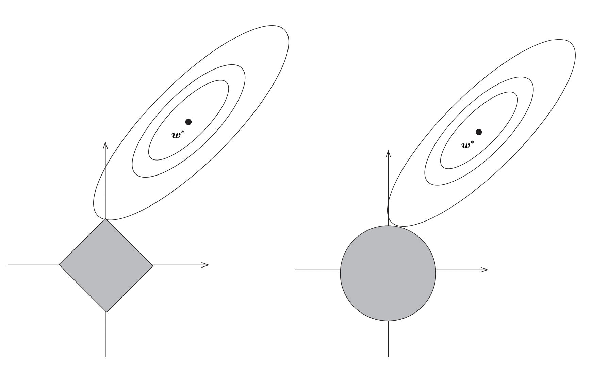

<!-- 封面样式 -->
<style>
@page {
    size: A4;
    margin: 20mm;
}
body {
    font-family: Arial, sans-serif;
    font-size: 14pt;
    line-height: 1.5;
}
.cover-page {
    display: flex;
    flex-direction: column;
    justify-content: center;
    align-items: center;
    height: 100vh;
    text-align: center;
}
.cover-title {
    font-size: 36pt;
    font-weight: bold;
    margin-bottom: 20px;
}
.cover-subtitle {
    font-size: 24pt;
    margin-bottom: 40px;
}
.cover-author {
    font-size: 18pt;
    margin-bottom: 20px;
}
.cover-date {
    font-size: 16pt;
}
</style>

<!-- 封面内容 -->
<div class="cover-page">
    <div class="cover-title">经济研究的实证方法与Stata代码</div>
    <div class="cover-subtitle">The Empirical Method of Economic Research and Stata Code</div>
    <div class="cover-author">作者:Laiqi Song</div>
    <div class="cover-date">日期: 2024年12月5日</div>
    在做任何分析之前都要做协变量平衡分析，防止由于对照组和控制组变量分布造成的误差。
</div>

- [1.Random Experiment](#1random-experiment)
- [2.OLS](#2ols)
  - [1. **OLS回归** ](#1-ols回归-)
  - [2. **加权回归** ](#2-加权回归-)
  - [3. **广义最小二乘** ](#3-广义最小二乘-)
  - [4. **迭代加权最小二乘方法（不要求）** ](#4-迭代加权最小二乘方法不要求-)
  - [5. **岭回归** ](#5-岭回归-)
  - [5. **Lasso回归** ](#5-lasso回归-)
- [3.Limit dependent varible](#3limit-dependent-varible)
  - [1. **Logit模型** ](#1-logit模型-)
  - [2. **Probit模型**  ](#2-probit模型--)
  - [3. **泊松分布**](#3-泊松分布)
  - [4. **负二项回归**](#4-负二项回归)
  - [5. **零膨胀**](#5-零膨胀)
  - [6. **截尾回归**](#6-截尾回归)
  - [7. **Tobit模型**  ](#7-tobit模型--)
  - [8. **拟合优度**](#8-拟合优度)
- [4.Matching](#4matching)
  - [1. **精确匹配** ](#1-精确匹配-)
  - [2. **模糊匹配**](#2-模糊匹配)
  - [3. **倾向得分匹配PSM** ](#3-倾向得分匹配psm-)
- [5.Instrument Variable](#5instrument-variable)
  - [**1.弱工具变量检验**](#1弱工具变量检验)
  - [**2.外生性（排除性）检验**](#2外生性排除性检验)
  - [**3.过度识别检验**](#3过度识别检验)
- [6.Panel Data](#6panel-data)
  - [**1.固定效应**](#1固定效应)
- [7.DID](#7did)
  - [**1.平行趋势假定（无法直接检验）**](#1平行趋势假定无法直接检验)
  - [**2.不满足平行趋势假定的解决方法**](#2不满足平行趋势假定的解决方法)
  - [***3.DID形式***](#3did形式)
  - [4.DID的扩展](#4did的扩展)
  - [**4.事件研究法ES**](#4事件研究法es)
- [8.RDD](#8rdd)
  - [**1.断点估计假设**](#1断点估计假设)
  - [**2.断点估计**](#2断点估计)
- [9.CIC](#9cic)
  - [1.CIC的原理](#1cic的原理)
  - [2.代码](#2代码)
- [10.SCM](#10scm)
  - [1.简介以及注意事项](#1简介以及注意事项)
  - [2.代码](#2代码-1)
- [11.分位数回归](#11分位数回归)
- [12.生存分析](#12生存分析)
- [实用小代码stata](#实用小代码stata)
- [一些方法](#一些方法)
- [一些知识](#一些知识)

<div style="page-break-after: always;"></div>

## <div style="font-size:25px;text-align:center;">1.Random Experiment</div>

1. 在进行因果估计之前为了避免存在样本分布问题，或者选择性问题，通常会对对照组和样本组进行随机化分析，即计算对照组和实验组具有近似的样本分布。这样可以表示条件独立性。

    ```stata
    // 随机实验验证 对于分组进行验证 检查子组内的平衡
    gen subgroup = group(变量) // 生成分组变量   这个公式会生成一个新的变量，这个变量是根据原来的变量进行取分组值的
    bysort subgroup: summarize(变量) // 按照分组变量进行分组，然后对变量进行描述性统计 因为产生的太快了，需要一个变量一个变量跑 ，然后j子组内对照组和实验组进行对比
    ```

    - **分组求回归等公式**

    ```stata
    // 分组求回归等公式
    bys subgroup: logit/reg y x
    ```

2. 异方差和同方差的检查

   ```stata
   reg price rm crim //首先普通回归，看其残差图的分布推知误差，因为残差基本包含误差。
   rvfplot  //绘制残差图
   ```

3. 多重共线性检验

   ```stata
    reg y x controls //将面板数据当成截面数据做回归
    estat vif //方差膨胀因子 ，VIF最大不超过10，严格来说不应高于5
   ```

<div style="page-break-after: always;"></div>

## <div style="font-size:25px;text-align:center;">2.OLS</div>

>OLS的基本假设：
>1. 线性：因变量和自变量之间是线性关系
>2. 严格外生性：自变量与误差项之间不存在相关性，这保证了$E(\xi_i)=0$以及$E(\xi_ix_i)=0$  其检验为：研究人员可以比较 FE 和 FD 估计，或者在使用 IV 时比较 FE-2SLS 和 FD-2SLS 估计。如果二者产生显著差异，往往是违反了严格外生性。
>3. 无多重共线性：自变量之间不存在高度相关性
>4. 球形扰动项：同方差，无自相关

***误差项和残差项的是不同的，误差项就在那里，但是分布不知道，但是残差项则是根据你估计的好坏变化。***
>异方差指的是误差，由于误差项不确定，所以假设对于每一个i都有一个分布，由$\beta$的推导知异方差的影响，从回归分布图也可以看出来，同方差的分布相对于回归线是均匀的，但是异方差不均匀。（误差由于截距的存在，均值为0）

### <div style="font-size:20px;">1. **OLS回归** </div>

在进行ols回归时，为了保证ols估计无偏，满足条件，需要保证其是线性的。***利用作图***

```stata
reg y x1 x2 x3 //robust 异方差情况，可以通过i.x加固定效应
```

### <div style="font-size:20px;">2. **加权回归** </div>

由于不同方差的存在，直观上来说，对不同方差的数据进行相同加权是不合理的，***大方差加小权***。其中一个方法：用方差的倒数进行最小残差加权。
$$
\hat\mu= \arg \mathop{\min}\limits_{\mu} \sum_1^n \frac{(y-\mu)^2}{\sigma^2}
$$

```stata
reg y x1 x2 x3 [aweight = weight] //加权回归
```

此时ols是无偏的，但不是BLUE的。加权ols很好解决这一点。
***由于需要确切的知道误差的方差，这在现实中是不可能的，所以一般使用自己的加权，或者使用robust***

### <div style="font-size:20px;">3. **广义最小二乘** </div>
***当误差的方差已知（需要预测方差的形式）***，那么根据思想:
模型$y=x\beta+\epsilon$ 两边乘$\Sigma^{\frac{-1}{2}}$ 
以下是将该式子翻译为LaTeX代码的结果：
$$
y^* \triangleq \Sigma^{-1/2}y = \Sigma^{-1/2}X\beta + \Sigma^{-1/2}\varepsilon \triangleq X^*\beta + \varepsilon^*, \quad \varepsilon^* \sim (0, I_{n})
$$
已知该模型满足GM假设，则误差项的误差平方和为 
$$\Vert y^*-x^*\beta \Vert = (y-x\beta)^T\Sigma^{-1}(y-x\beta)$$ 
则其最优BLUE的估计$\hat{\beta}_{GLS}=(x^{*T}x^*)^{-1}x^{*T}y=(x^T\Sigma^{-1}x)^{-1}x^T\Sigma^{-1}y$
这就是广义最小二乘估计。

```stata
reg price rm crim
gen lny_resid = log(resid^2) //产生残差平方和对数的变量（为了线性回归回归）
reg lny_resid rm crim //进行残差回归，估计残差的具体形式
predict lnh, xb  //线性预测残差
gen var_pred = exp(lnh)  //预测的恢复 这里预测方差的形式
gls price rm crim, weights(var_pred)//GLS回归，使用var_pred为权重
```

### <div style="font-size:20px;">4. **迭代加权最小二乘方法（不要求）** </div>
若方差是较为复杂项，其中的方差也有参数需要求解，那么方法就是迭代加权。即固定$\theta$然后运用GLS，然后固定$\beta$，残差求解$\theta$
$$
Q(\theta,\beta)=(y-x\beta)^T\Sigma^{-1}(\theta)(y-x\beta)+log|\Sigma(\theta)|
$$

### <div style="font-size:20px;">5. **岭回归** </div>

[岭回归细节](https://www.bbbdata.com/text/29)
在普通的ols回归中，我们需要满足非共线性或秩条件，当存在共线性时会导致估计出现巨大偏误，参数无法估计，多重共线性检验可以用**vif**。而岭回归则可以避免这个问题，通过岭回归作为一种正则化方法。
**思想：** 核心思想是在OLS的基础上引入一个正则化项，通过对回归系数进行调整来 ***解决多重共线性问题*** 。正则化项是一个惩罚项，它能够约束回归系数的大小，降低模型的复杂度，防止过拟合
其损失函数为：
$$
L(w)=\sum_{i=1}^{N}(y-xw)^2+\alpha \sum_{i=1}^{n}(w_i)^2  
$$
其中$\alpha$为惩罚系数 ，n为系数数量
求解得$W=(X^TX+\alpha I)^{-1}X^TY$ 此时 对于x的秩条件放松，秩条件必然满足，$\alpha$控制的系数的大小
***怎么控制$\alpha$:*** ***岭迹图***，找到合适的$\alpha$，即不停的变动$\alpha$，然后看其残差的变化。
<div align="center">
    
</div>

***确定思想：***（存在优先级）

- w,不要过大，过大会导致不稳定
- $\alpha尽量小$：在保障w不太大的情况下，尽量取更小的$\alpha$，防止过强的惩罚

<div align="center">
    
</div>
<div  style="text-align:center;">不选</div>
<div align="center">
    
</div>
<div  style="text-align:center;">w一般需要比较稳定</div>

```stata
//岭回归
ridgereg y x1 x2 x3..., l(lamda_value)  //lamda_value表示惩罚系数
// 定义一个岭参数的取值范围，这里从0.1到1，间隔为0.1
forvalues lambda = 0.1(0.1)1 {
    ridgereg y x, l(`lambda')
    est store ridge_`lambda'  // 将每次的估计结果存储起来，方便后续比较等操作
}
```

```stata
//岭迹图
// 选择因变量和自变量，这里以mpg为因变量，weight、length等为自变量举例
local yvar mpg
local xvars weight length foreign
//得到自变量的数量
local k : word count `x'
// 创建一个矩阵来存储系数估计值，行数为lambda值的数量，列数为自变量数量 + 1（包括lamda）
matrix coef_matrix = J(`=word count `lambda_values`',`=`k'+1',.)
// 循环进行岭回归并存储系数
local i = 1
foreach lambda of local lambda_values {
    ridgereg `yvar' `xvars', l(`lambda')
    matrix coef_matrix[`i',1] = `lambda' // 存储lambda值在第一列
    forvalues j = 1/`k' {
        matrix coef_matrix[`i',`j'+1] = _b[`xvars'[`j']]
    }
    local i = `i'+1
}
```

### <div style="font-size:20px;">5. **Lasso回归** </div>

*lasso回归也是为了治疗共线性，但是不像岭回归那样，其稀疏性会帮助去除一些变量，而不是保证秩条件，更加残暴* Lasso只起到变量筛选的问题
Lasso回归是在岭回归的基础上将惩罚函数改为了绝对值的函数，其损失函数为：
$$
L(w)=\sum_{i=1}^{N}(y-xw)^2+\alpha \sum_{i=1}^{n}|w_i|
$$
其他基本不变。Lasso方法一般采用坐标下降法进行求解初始化后不停迭代w，最后达到驻点。

<div align="center">
    
</div>

***lasso reg***：
$$
  \mathop{\min}\limits_{w,b} \sum_{i=1}^{N}(y-xw)^2 \\
  s.t. \Vert w \Vert_1 \leq t
$$
***ridge reg：***
$$
  \mathop{\min}\limits_{w,b} \sum_{i=1}^{N}(y-xw)^2 \\
  s.t. \Vert w \Vert_2^2 \leq t
$$
可将t看作惩罚系数的程度，t越小，惩罚力度越大
<div align="center">
    
</div>

易知，lasso的约束是正方形，而岭回归的约束则是圆形，因此lasso更容易产生稀疏性。KKT条件更容易到坐标轴上，因此更容易产生 ***稀疏性(去除不适合的变量)***。

```stata
lasso logit xy , selection(cv, alllambdas) stop(0) //lasso回归 可以根据数据选择logit还是liner，其中cv是交叉验证，alllambdas是所有的lamda值
Lassoknots //选择选值过程
Lassoknots //绘制交叉验证图，给出不同lamda下的交叉验证结果
coefpath,legend(on position(12) cols(4)) //coefpath函数来绘制lasso的系数路径（coefficient paths）
```

<div style="page-break-after: always;"></div>

## <div style="font-size:25px;text-align:center;">3.Limit dependent varible</div>

***为什么受限被解释变量不能使用OLS：OLS会产生异方差问题，同时会导致预测值大于1或者小于0，这没有意义。***
当相关变量是虚拟变量或选择变量时，我们必须使用其他模型，例如 logit 或probit模型来估计模型

### <div style="font-size:20px;">1. **Logit模型** </div>

```stata
logit y x1 x2 x3 //默认使用最大似然估计
//关于logit的迭代(optimal函数的要求)以及公式可以看崔学彬的ppt，就是MLE和回归的替换
logit y x1 x2 x3, or //odds ratio输出就是 exp(\beta)
//由于我们只能通过Odds变化的倍数推断出概率的变化方向，
//为了推断自变量变化一单位实际概率的变化。用边际处理利用logit求平均处理效应
margins, dydx(x1) //其求x1对因变量的平均处理效应，系数为概率变化值（百分比衡量）
//当 x1增加 1 个单位时，y=1的概率变化的百分比
margins, dydx(x1) at(x1=0) //求x1=0时的平均处理效应，其他值为均值
margins, dydx(x1) atmeans //求均值时的平均处理效应
```

<div style="color:blue;"><b>logit模型使用logit函数，而probit使用逆正态函数函数</b></div>  

### <div style="font-size:20px;">2. **Probit模型**  </div>

```stata
probit y x1 x2 x3 //默认使用最大似然估计
//由于无法使用probit模型求解odds，只能使用边际处理
margins, dydx(x1) //其求x1对因变量的平均处理效应，系数为概率变化值（百分比衡量）
//当 x1增加 1 个单位时，y=1的概率变化的百分比（概率本来就是百分比）
margins, dydx(x1) at(x1=0) //求x1=0时的平均处理效应
margins, dydx(x1) atmeans //求均值时的平均处理效应
```

### <div style="font-size:20px;">3. **泊松分布**</div>

条件1：一个事件的发生不影响其它事件的发生，即事件独立发生，不存在传染性、聚集性的事件。
条件2：因变量Y服从Poisson分布，总体均数𝜆 =总体方差σ²。

```stata
poisson y x1 x2 x3 vce(robust) //泊松回归,robust是异方差情况
poisson, irr //输出的是其均值变化倍数$exp(\beta)$，那么是期望发生次数𝜆的变化倍数
margins x //边际处理，得出平均发生次数,其他值为均值，是指变化一单位的因变量的变化
estat gof //泊松分布是否符合我们的数据，需要拟合优度卡方检验在统计上不显著
```

### <div style="font-size:20px;">4. **负二项回归**</div>

其服从的Poisson分布强度参数λ服从γ分布时，所得到的复合分布即为负二项分布
在负二项分布中，λ 是一个随机变量，方差λ(1+kλ)远大于其平均数，k为非负值，表示计数资料的离散程度。当趋近于0时，则近似于Poisson分布，过离散是负二项分布相对于Poisson分布的重要区别和特点。
可用拉格朗日算子统计量检验是否存在过离散，

```stata
nbreg y x1 x2 x3, vce(robust) //负二项回归
//负二项回归实际上和泊松回归一样，其数据过于离散，stata结果可以像泊松回归一样进行解释
//同时会输出一个拉格朗日算子统计量检验是否存在过离散。若原假设成立就可以用
```

### <div style="font-size:20px;">5. **零膨胀**</div>

其主要为了解决数据中存在大量的0值，同时其数据分布不符合泊松分布，因此需要进行零膨胀回归
零膨胀模型有两部分，泊松计数模型和用于预测多余零的 logit 模型
stata提供了Vuong统计量,Vuong”统计量很大 (为正数)，则应该选择零膨胀泊松回归

```stata
zinb y x1 x2 x3, vce(robust) //零膨胀负二项回归
//forcevuong: 用于比较 zinb和nb的模型效果
//forcevuong不能与 vce() cluster standard error 同用, 可先比较两个模型后再聚合标准误
zip y x1 x2 x3, vce(robust) //零膨胀泊松回归 参数与上同
```

### <div style="font-size:20px;">6. **截尾回归**</div>

截尾回归是指因变量的观测值只能在某个区间内取值，而不能取到某个区间之外的值。截尾回归的模型是对数线性模型，其估计方法是最大似然估计法。

```stata
truncreg y x1 x2 x3, ll(0) ul(1) //截尾回归 ll() 选项表示发生左截断的值，ul() 选项用于指示右截断值
```

### <div style="font-size:20px;">7. **Tobit模型**  </div>

归并回归 (censored regression) 模型
*当某个值大于或等于某一阈值时，就会出现上述归并，因此真实值可能等于某一阈值，但也可能更高*

```stata
tobit y x1 x2 x3 //截尾回归 ll() 选项表示发生左截断的值，ul() 选项用于指示右截断值
```

### <div style="font-size:20px;">8. **拟合优度**</div>

- Likelihood ratio index (LRI)似然比指数

   ```stata
   //需要储存模型
   estimates store 名称
   lrtest reduced_model full_model //需要其拒绝原假设
   ```

- Akaike Information Criterion (AIC)
   自动输出越小越好
- Bayesian Information Criterion (BIC)

    ```stata
    estat ic //输出AIC和BIC 选择最小的
    ```

- Hit rate

<div style="page-break-after: always;"></div>

## <div style="font-size:25px;text-align:center;">4.Matching</div>

<p style="text-align:center;"><span style="font-weight:bold;color:red;background-color: yellow">匹配的思路比较简单：匹配与处理组近似的反事实组进行平均</span></p>

###  <div style="font-size:20px;">1. **精确匹配** </div>

```stata
//需要两个数据集
merge 1:1 x using data2 //精确匹配,匹配后会生成一个新的数据集，其中包含了匹配成功的观测值
```

###  <div style="font-size:20px;">2. **模糊匹配**</div>

stata中没有模糊匹配的专有代码

```stata
//同一数据集中两列中的数据
matchit varname1 varname2 [, options]
*- 两个不同数据集中的数据
matchit idmaster txtmaster using "data2.dta"
//quired(varlist) 为可选择的命令，其允许用户指定一个或多个必须完全匹配的变量
reclink varlist using filename , idmaster(varname) idusing(varname) gen(newvarname) [required(varlist)]
//method()：reclink支持多种匹配方法
//idmaster(varname) idusing(varname)不一定相同
```

###  <div style="font-size:20px;">3. **倾向得分匹配PSM** </div>

其具有降维的力量，同时避免了因协变量较多带来的维度诅咒问题。由于倾向得分匹配是被处理的概率，因此可以通过被处理概率来进行匹配。即可以用Logit或Probit模型来估计倾向得分
这是由于倾向得分定理表示得分值也满足条件独立性，因此可以消除选择偏误。

- 倾向得分匹配

    ```stata
    logit treat x1 x2 x3 //使用treat作为因变量，其他协变量进行估计得分，这估计的是协变量相同时被处理的概率
    predict pscore, pr
    psmatch2 treat, pscore(pscore) outcome(y) //进行匹配
    ```

- 近邻匹配

    ```stata
    psmatch2 treat x1 x2, outcome(y) neighbor(n) //进行近邻匹配 1对n
    ```

- 带卡尺近邻匹配

    ```stata
    psmatch2 treat x1 x2, outcome(y) caliper(0.1) n(1) //进行近邻匹配 1对1,卡尺为0.1，只有在卡尺内部才行
    ```

- 核匹配
    核函数与其他的匹配不同，核函数会利用所有的数据，依据核函数进行加权。即对他们的Y进行加权

    ```stata
    psmatch2 treat x1 x2, outcome(y) kernel kerneltype(normal/biweight/epan/uniform/tricube) //进行核匹配
    ```

<div style="page-break-after: always;"></div>

## <div style="font-size:25px;text-align:center;">5.Instrument Variable</div>

我们在使用工具变量时，需要进行检验，最常见的就是排除性和相关性。  
进行IV时我们需要讲故事，并且数据检验其合理性：同时其最基础的工具变量回归的代码如下
***2sls只有当满足5个假设时才能是LATE，不然就是ATE，但是此时不准确，此时的2sls得出的系数由于工具变量的抵抗依从性，出现问题。***
```stata
ivregress 2sls y (x1 = z1 z2) x2 x3, robust
```

### <div style="font-size:20px;">**1.弱工具变量检验**</div>

1. **F检验**

    ```stata
    reg y x ,robust  // OLS回归估计
    ivregress 2sls y (x=z1,z2),robust  // 2SLS回归估计   
    reg x z1 z2,robust  // 第一阶段回归估计
    test z1 z2   //查看是否有弱工具变量问题，F检验 大于10即可 F估计与弱IV的关系来自于causal inference
    ```

    <div style="color:blue;"><b>可以通过以上的第一阶段回归查看第一阶段的参数从而判断工具变量的相关性</b></div>  
    也可以比较OLS和2SLS的结果，看看是否有差异

2. **Cragg-Donald检验**  
   一般条件是同方差，无自相关

    ```stata
    ivreg2 y (x1 x2 = z1 z2), robust  //Cragg-Donald检验,要大于 10
    ```

3. **Kleibergen-Paap检验** 无iid假设

    ```stata
    ivreg2 y (x1 x2 = z1 z2), robust   //Kleibergen-Paap检验,要大于 10
    ```

### <div style="font-size:20px;">**2.外生性（排除性）检验**</div>

1. **Hausman检验**  

    ```stata
    //豪斯曼检验 这是在同方差条件下的检验
    reg y x1 x2
    estimates store ols
    ivregress 2sls y (x1 = z) x2
    estimates store iv
    hausman iv ols, constant sigmamore
    //chi - squared和p - value。p 小于0.05，拒原，认为变量是内生变量,p最好大一点
    ```

2. **DWH检验**  

    用上一个检验的结果就行，也会输出DWH检验的结果。这是在异方差条件下的检验

3. **GMM估计**

    ```stata
    ivregress gmm y (x1 = z1 z2), twostep robust     
    estat overid   //原假设：工具变量是有外生的
    ```

### <div style="font-size:20px;">**3.过度识别检验**</div>

1. **Sargan检验**  用于线性模型中的工具变量过度识别检验 --*需要满足工具变量多于内生变量*

    ```stata
    ivregress 2sls y (x1 = z1 z2)     //原假设为所有变量外生
    ```

2. **Anderson - Rubin 检验**  用于非线性模型或联立方程模型中的工具变量过度识别检验 --*需要满足工具变量多于内生变量* 
    以联立方程模型为例

    ```stata
    sysreg (eq1: y1 = x1 x2 (y2 = z1 z2)) (eq2: y2 = x3 x4 (y1 = z3 z4))
    test [eq1_y2] [eq2_y1]  // 原假设是不存在过度识别问题
    ```

3. **Hansen J统计量** 非iid时用Hansen J统计量
   和Sargon检验类似 非iid时用Hassen统计量 原假设为所有变量外生

<div style="page-break-after: always;"></div>

## <div style="font-size:25px;text-align:center;">6.Panel Data</div>
***相关性变为因果的重要条件就是不存在遗漏变量***

###  <div style="font-size:20px;">**1.固定效应**</div>

***注意是平衡面板***

1. **合并最小二乘法（**需要满足严格外生性，基本和下面的没啥差别）
2. **固定效应demean**

    ```stata
    xtreg y x1 x2 x3, fe  //固定效应
    ```

    其无法解释双向因果和随时间变化的异质性（这是由于demean去掉的是不随时间变化的异质性）
3. **注意事项**
    固定效应也有高纬度，当控制了高纬度就无需控制低纬度，有时候控制高纬度的固定会更准确，比如时间-省份固定效应


<div style="page-break-after: always;"></div>

## <div style="font-size:25px;text-align:center;">7.DID</div>

DID本来就是对于政策进行研究的，所以基本都会涉及时间，而在队列DID中将时间分块

***<font color=red>DID的假设:</font>***

1. 平行趋势假设（认为事前平行使反事实也平行
2. 政策影响无溢出效应或交互效应（SUVTA）
3. 无预期效应
4. 处理效应同质
5. 线性函数假设，就是和回归类似的相同假设

***平行趋势假设和安慰剂检验必做***
>DID流程：
    1. 首先进行平行趋势检验，根据实际的处理多期还是同时间进行
    2. 其次进行根据实际情况选择DID大家庭
    3. 安慰剂检验，稳健性检验，异质性检验

###  <div style="font-size:20px;">**1.平行趋势假定（无法直接检验）**</div>

1. ***用多期数据进行之前期数的假定，作图来看是否满足***但是这不是并不是充分条件，只是经验假设

```stata
xtdidreg 方法画图
```
2. ***滞后期以及提前期加入*** 多期的平行趋势检验，若 ***是多时点DID，那么这就是<font color=green>事件研究法</font>***
**同一时间处理：**
    其前期系数需要接近0，而滞后期系数需要是显著的，**这是因为系数为0表示这一项的对照组的结果和有这一项的处理组的结果的，在其他效应不变的情况下，是平行的**
    滞后期的系数是所有**组的处理后期**的加权平均值，而这里可能存在**组异质性偏差**。同时滞后期每年的系数不同，是因为可能存在**政策的时间效应以及纯时间效应**（可以看下文的数据结构）

```stata
//和上面的代码基本相同，但是加入了前期和滞后期
xi: reg lnr i.repeal*i.year i.fip acc ir pi alcohol crack poverty income ur if bf15==1 [aweight=totpop], cluster(fip)
//这里i表示对于其取值进行虚拟变量分类，stata中会选择一个类别作为基准变量，这样可以避免共线性。那么就有（3-1）*（5-1）个变量，同时这也会将每个虚拟变量放进去。
//xi是 Stata 中的一个前缀命令，主要用于处理分类变量的交互项。它会自动为分类变量创建虚拟变量，以便更好地进行回归分析。
```

<p style="text-align:center;"><span style="font-weight:bold;color:red;background-color: yellow">剩下的画图命令可以参考坎宁安的代码</span></p>

<div align="center">
    
</div>

<div align="center">
    
</div>

**同一时间处理：** 检查平行趋势就需要事件研究法


###  <div style="font-size:20px;">**2.不满足平行趋势假定的解决方法**</div>

1. ***增加组-时间固定效应*** 这是为了**去除组的时间异质性**

```stata
//teset告诉我们面板数据的实际结构
xtset id year // 设置以id为个体维度，year为时间维度的面板结构
gen did = treated * (year >= 政策实施时间点)  // 政策是在2010年实施，那就是(year >= 2010)(多期可以用前期的数据的做平行趋势检验)
xtreg y treated (year >= 政策实施时间点) did i.group_id#i.year, fe  // DID 可加聚类稳健的标准误 vce(cluster group_id)
```

2. ***三重差分*** 这是为了**去除时间的异质性**
三重差分和实际的二重差分也是使用xtreg命令，但是根据函数形式，其需要构建更多的二重交互项和一个三重交互项
其实际上是在二重差分的基础上，加入了大组（州）中的不与控制相关的另一个组，从而进行差分去除大组内的平行趋势的干扰，***但是在实际上这并不是充分的，因为无法保证安慰剂组与实验组在两大组内的关系相同***

<p style="text-align:center;"><span style="font-weight:bold;color:red;background-color: yellow">可以去坎宁安那里偷图和代码</span></p>

```stata
xtset id year // 设置以id为个体维度，year为时间维度的面板结构
gen 多个did
xtreg y 多个did 控制变量  聚类稳健的标准误 //同时也可以加入分组-时间的固定效应
```

3. ***使用安慰剂检验***(证伪检验，是否满足平行趋势)
***核心思想：*** 通过构造虚拟的干预（通常是模拟出不存在实际影响的 “假” 处理情况），然后按照与原研究相同的分析步骤去进行分析，如果在这种虚拟情况下依然得出类似原研究中有显著影响的结果，那就意味着原结果可能是受到了其他未控制因素等偏误影响而不可靠；反之，如果虚拟情况下没有得出显著结果，则在一定程度上可以增强对原研究中所发现因果关系等结论的信心。

>安慰剂检验实际上：就是找到安慰剂组再进行一次DID，如果系数为0那么就证明平行趋势假设是有效的

```stata
reg y treated##time,fe //这里的##表示同时加入两个自变量和他们的交互项
同时在断点RDD中仍然存在着安慰剂检验也是差不多，检验是否存在操纵以及其他变量的跳变
```
   *主要方法*
   1. 改变政策发生时间
   2. 随机生成实验组，需要重复多次
   3. 替换样本
   4. 替换变量

### ***<div style="font-size:20px;">3.DID形式</div>***

1. ***政策（处理效果）不随时间变化，即之前的时间趋势基本不变***

<table>
<thead>
<tr class="header">
<th>id</th>
<th>year</th>
<th>y</th>
<th>d</th>
<th>t</th>
<th>dt</th>
</tr>
</thead>
<tbody>
<tr class="odd">
<td>1</td>
<td>1</td>
<td>3</td>
<td>1</td>
<td>0</td>
<td>0</td>
</tr>
<tr class="even">
<td>1</td>
<td>2</td>
<td>4</td>
<td>1</td>
<td>0</td>
<td>0</td>
</tr>
<tr class="odd">
<td>1</td>
<td>3</td>
<td>5</td>
<td>1</td>
<td>0</td>
<td>0</td>
</tr>
<tr class="even">
<td>1</td>
<td>4</td>
<td>6</td>
<td>1</td>
<td>0</td>
<td>0</td>
</tr>
<tr class="odd">
<td>1</td>
<td>5</td>
<td>10</td>
<td>1</td>
<td>1</td>
<td>1</td>
</tr>
<tr class="even">
<td>1</td>
<td>6</td>
<td>11</td>
<td>1</td>
<td>1</td>
<td>1</td>
</tr>
<tr class="odd">
<td>1</td>
<td>7</td>
<td>12</td>
<td>1</td>
<td>1</td>
<td>1</td>
</tr>
<tr class="even">
<td>1</td>
<td>8</td>
<td>13</td>
<td>1</td>
<td>1</td>
<td>1</td>
</tr>
<tr class="odd">
<td>2</td>
<td>1</td>
<td>1</td>
<td>0</td>
<td>0</td>
<td>0</td>
</tr>
<tr class="even">
<td>2</td>
<td>2</td>
<td>2</td>
<td>0</td>
<td>0</td>
<td>0</td>
</tr>
<tr class="odd">
<td>2</td>
<td>3</td>
<td>3</td>
<td>0</td>
<td>0</td>
<td>0</td>
</tr>
<tr class="even">
<td>2</td>
<td>4</td>
<td>4</td>
<td>0</td>
<td>0</td>
<td>0</td>
</tr>
<tr class="odd">
<td>2</td>
<td>5</td>
<td>5</td>
<td>0</td>
<td>1</td>
<td>0</td>
</tr>
<tr class="even">
<td>2</td>
<td>6</td>
<td>6</td>
<td>0</td>
<td>1</td>
<td>0</td>
</tr>
<tr class="odd">
<td>2</td>
<td>7</td>
<td>7</td>
<td>0</td>
<td>1</td>
<td>0</td>
</tr>
<tr class="even">
<td>2</td>
<td>8</td>
<td>8</td>
<td>0</td>
<td>1</td>
<td>0</td>
</tr>
</tbody>
</table>
很明显可以看出，政策的y虽然在一直变化，但是去除了时间趋势之后，其真正的处理效应是不变的。

***2. 政策（处理效果）随时间变化，即之前的时间趋势基本不变***
<table>
<thead>
<tr class="header">
<th>id</th>
<th>year</th>
<th>y</th>
<th>d</th>
<th>t</th>
<th>dt</th>
</tr>
</thead>
<tbody>
<tr class="odd">
<td>1</td>
<td>1</td>
<td>3</td>
<td>1</td>
<td>0</td>
<td>0</td>
</tr>
<tr class="even">
<td>1</td>
<td>2</td>
<td>4</td>
<td>1</td>
<td>0</td>
<td>0</td>
</tr>
<tr class="odd">
<td>1</td>
<td>3</td>
<td>5</td>
<td>1</td>
<td>0</td>
<td>0</td>
</tr>
<tr class="even">
<td>1</td>
<td>4</td>
<td>6</td>
<td>1</td>
<td>0</td>
<td>0</td>
</tr>
<tr class="odd">
<td>1</td>
<td>5</td>
<td>8</td>
<td>1</td>
<td>1</td>
<td>1</td>
</tr>
<tr class="even">
<td>1</td>
<td>6</td>
<td>11</td>
<td>1</td>
<td>1</td>
<td>1</td>
</tr>
<tr class="odd">
<td>1</td>
<td>7</td>
<td>15</td>
<td>1</td>
<td>1</td>
<td>1</td>
</tr>
<tr class="even">
<td>1</td>
<td>8</td>
<td>20</td>
<td>1</td>
<td>1</td>
<td>1</td>
</tr>
<tr class="odd">
<td>2</td>
<td>1</td>
<td>1</td>
<td>0</td>
<td>0</td>
<td>0</td>
</tr>
<tr class="even">
<td>2</td>
<td>2</td>
<td>2</td>
<td>0</td>
<td>0</td>
<td>0</td>
</tr>
<tr class="odd">
<td>2</td>
<td>3</td>
<td>3</td>
<td>0</td>
<td>0</td>
<td>0</td>
</tr>
<tr class="even">
<td>2</td>
<td>4</td>
<td>4</td>
<td>0</td>
<td>0</td>
<td>0</td>
</tr>
<tr class="odd">
<td>2</td>
<td>5</td>
<td>5</td>
<td>0</td>
<td>1</td>
<td>0</td>
</tr>
<tr class="even">
<td>2</td>
<td>6</td>
<td>6</td>
<td>0</td>
<td>1</td>
<td>0</td>
</tr>
<tr class="odd">
<td>2</td>
<td>7</td>
<td>7</td>
<td>0</td>
<td>1</td>
<td>0</td>
</tr>
<tr class="even">
<td>2</td>
<td>8</td>
<td>8</td>
<td>0</td>
<td>1</td>
<td>0</td>
</tr>
</tbody>
</table>
很容易看出去除了时间效应之后，其处理效应即政策效应也是变化的

***多期DID存在的问题***：

1. **处理效应随时间变化问题 导致一开始的平行趋势失效**
2. 处理效应异质性问题 --导致了负权重的发生，即最后一期的权重过大导致正处理被其中的负号抵消。
3. ***注意：*** 和处理的个体异质性有，就是加权使得负权重出现，对于坏的加大权，就是加权培根分解的第一项出现问题。
<p style="text-align:center;"><span style="font-weight:bold;color:red;background-color: yellow">主要是坏的控制组，用已经处理的组当作控制组</span></p>

### <div style="font-size:20px;">4.DID的扩展</div>
[DID大家庭参考](https://yuzhang.net/2023/10/25/Handbook%20of%20DID%20family_20231026/)

根据不同的情况，我们可以使用不同DID的变种

1. 标准DID(两期)

[连享会命令](https://mp.weixin.qq.com/s?__biz=Mzk0MDI1NTgyOQ==&mid=2247583584&idx=4&sn=1a0c896e4b48d44f8b954a3d8771849a&chksm=c2e7b85af590314c1fdbcb50512e5b28b1a6303b34452f3755839ab257768f4ad915523b11bf&scene=90&subscene=245&sessionid=1734335298&ascene=56&fasttmpl_type=0&fasttmpl_fullversion=7517157-en_US-zip&fasttmpl_flag=0&realreporttime=1734335310139&clicktime=1734335310&enterid=1734335310&devicetype=android-31&version=280036f1&nettype=ctnet&abtest_cookie=AAACAA%3D%3D&lang=en&exportkey=n_ChQIAhIQWr6z5udLne0hKqvgMunJORLfAQIE97dBBAEAAAAAAItBD7zLV2sAAAAOpnltbLcz9gKNyK89dVj02r7JnDEllobcaNLCSl4LEmDt%2B2M0DJz0tkIu8DFj9xe%2FZndUuKt%2BKV5wV6KdjALH%2FCOOW2iKDhtPi5f4y%2BwTSkvdaJdC3OuoyIKOJQ0veaRoMuU%2BrTQu097vE2UqpUrkHHzb96a7lDB29TukSINutc%2F991YArdW9HaFNTVCjHmzDrHSvfVI8CT5828yr2UQREmWQAMzLhhRwEt%2FsCAn4yHE6ECzCSbssQ29n%2FXrxw1n8%2BASnVCzwy9I%3D&pass_ticket=ygfLKR%2B1dTYYdpFvqe92hgYUGeWjD3WuTvsDeNjCLWni1ODVTe7Cz5L21AbpAC7A&wx_header=3)
```stata
//生成交互项
gen did = treated * time
xtset id year//设定时间和个体
//进行双向固定效应的DID估计（个体和时间固定效应）
xtreg y treated time did, fe
// 也可用reghdfe命令 加多个固定效应
//采用estfe进行固定效应yes/no的估计
reghdfe y treated time did, absorb(id year) 
```

2. <font color=red>多期DID</font>，异时DID-- ***由于个体变量受处理时间不同导致***

[TWFE以及多期DID事件研究法操作](https://mp.weixin.qq.com/s/k2kxnRvzHFk3LLdwByZzyw)
其操作经常会出现多重共线性问题，那么可以采用自己去掉基期，但是最好去现期和前期，不然若是去掉滞后期，若前期的系数的显著的，那么就无法分别前期系数的差异了。（相对于不显著显著，那么到底显不显著）。可以自己通过操作进行去除，事件研究法就可以这样。

```stata
//这也是事件研究的方法，看系数
//eventstudyinteract 人为舍弃-1期，最后一组为从不处理组，删除最后一期
drop if wave==11
gen time_to_treat =wave-wave_hosp
replace time_to_treat = 0 if wave_hosp==11
gen treat = !(wave_hosp==11)
gen never_treat=(wave_hosp==11)
tab time_to_treat
forvalues t= -3(1)2{
	if `t'<-1{
		local tname = abs(`t')
		gen g_m`tname'=time_to_treat==`t'
	}
	else if `t'>=0{
		gen g_`t'=time_to_treat==`t'
	}
}
eventstudyinteract oop_spend g_*,cohort(wave_hosp) control_cohort(never_treat) absorb(i.hhidpn i.wave) vce(cluster hhidpn)


//4.无从不处理组
gen time_to_treat =wave-wave_hosp
gen treat = !(wave_hosp==11)
gen never_treat=(wave_hosp==11)
tab time_to_treat
forvalues t= -3(1)3{
	if `t'<-1{
		local tname = abs(`t')
		gen g_m`tname'=time_to_treat==`t'
	}
	else if `t'>=0{
		gen g_`t'=time_to_treat==`t'
	}
}
eventstudyinteract oop_spend g_*,cohort(wave_hosp) control_cohort(never_treat) absorb(i.hhidpn i.wave) vce(cluster hhidpn)
```

<div align="center">
    
</div>

可以采用 $panelview$ 命令进行可视化
<font color=purple>但是多期did存在平行趋势以及时间的处理异质性等原因</font>导致多期DID估计的平均处理效应**不准确**，分别反映在培根分解上（处理的个体异质性导致加权权重出现问题，出现负权重冲解出来）
多期 DID 估计的最后系数 ***是多个不同处理效应（不同组）的加权平均（异质性）(按照占有比重加权，但是组异质类似于2sls那种)*** 
<p style="text-align:center;"><span style="font-weight:bold;color:red;background-color: yellow">根据代码的实际操作，是用滞后期进行操作的，那么不管任何处理时间的组，都存在滞后期，那么就一定存在对照组以及加权问题</span></p>
<div align="center">
    
</div>

<div align="center">
    
</div>

<p style="text-align:center;"><span style="font-weight:bold;color:red;background-color: yellow">上面的式子很容易发现最后的处理组无法对照产生的误差（普通组自我对照也有时间趋势问题），也可以看出Treat_it若最后处理组和前期处理组（所有），那么都是1，就会产生偏误，</span></p>

   1. Bacon decomposition--培根分解（加权解决异质处理效应）
      培根提出双向固定效应估计量等于数据中所有可能的两组或两期估计量的加权平均值（多期最后一期出现问题），这是一种评估偏误的手段。可以看出交叠DID的应用效果。
      其假设为：1. 平行趋势假设 2. 随时间固定的处理效应
      其培根分解的第三项是由于处理时间趋势异质性以及时间趋势造成的差异，前两项的处理效应被冲解为**负权重**
      培根认为所有处理期的对照组都是未处理期之前期的加权（包括已经处理的组）
      ***双向固定效应估计量 (TWFEDD) 等于数据中所有可能的两组或两期 DD 估计量的加权平均值。***

       <div align="center">
           
       </div>

       ***该式子告诉我们主要是平行趋势假定以及时间不变的处理效应而时间趋势异质性（个体时间跳跃以）被两个假设给内部消除了，处理效应的异质性会使加权的权重出现问题***
       但是培根分解无法解决**负权重**的显示

       ```stata
       bacondecomp asmrs post pcinc asmrh cases, stub(Bacon_) robust //这里是培根分解，post为处理变量
       ```
       [培根分解操作及解释](https://mp.weixin.qq.com/s/NKy9uBMzijNzn6tR6lTXpQ)

   2. Callaway and Sant'Anna 的识别异质性did的想法：
      其适用情景：

      - 时间分为多期
      - 实验组受到政策冲击的时间并非同一
      - 实验组和对照组只有在控制了协变量之后才满足平行趋势假定

      ***结果与TWFE做比较，可以看看基准回归是否合理***
      不存在从未接受处理组时，  Callaway and Sant'Anna 提出的估计量可以使用尚未接受处理组作为控制组，IＷ 估计量则需 要对样本进行删减并使用最后接受处理的样本作为控制组
      ```stata
      csdid depvar [indepvars] [if] [in] [weight], [ivar(varname)] time(varname) gvar(varname) [options]
      //添加 agg(aggtype) 选项，用于选择计算平均处理效应的加权方法。可选择的加权方法包括：simple 对应上述的 Simple ATT；group 对应上述的 Group ATT；calendar 对应上述的 Calendar Time ATT；event 对应上述的 Dynamic ATT。
      //notyet: 定义 “从未被处理” 的样本 (Nevered-treated) 和 “还未被处理” 的样本 (Not-yet-treated) 为对照组。当不添加 notyet 时 (默认情况)，只选择 “从未被处理” 的样本 (Nevered-treated) 作为对照组。
      //加 method(method) 选项，用于选择估计方法。可选择的估计方法包括：drimp 为基于逆概率加权最小二乘法得到的双重稳健 DID 估计量，为默认估计方法；dripw 为基于逆概率的普通最小二乘法得到的双重稳健 DID 估计量；reg 为普通最小二乘法；stdipw 为标准化的逆概率加权法；ipw 为逆概率加权法。
      ```
      
   3. Stacked DID 堆叠DID
      每个堆叠包括来自同一时间段内接受治疗的一组单位和从未接受过治疗的所有单位的所有观察结果。通过将单个治疗单位队列与从未治疗过的单位进行比较，在每个堆叠中确定效果。
      如果效果因治疗队列而异，则可能会偏向双向固定效应
      ```stata
      stackedev {outcome} {leads_lags_list} [if] [in] [weight] , cohort(variable) time(variable) never_treat(variable) unit_fe(variable) clust_unit(variable) [options]  
       ```

      ***谨慎采用***
   4.  did2s 两步回归法
      当处理组个体接受处理的时间是交错的，而且平均处理效应随着组别以及时间发生变化时，常见的双重差分估计就不能识别一个典型处理效应并做出合理的度量
      在第一阶段识别组别效应和时期效应，在移除了组别效应和时期效应之后，在第二阶段，通过比较处理组和对照组的结果差异来识别平均处理效应。两阶段方法对于被处理的时间是交错的以及处理效应具有异质性的情况下估计结果是稳健的
   5. did_multiplegt 多期多个体模型
       解决多期多个个个体，处理从进入到退出的过程
   6. did_imputation 事件研究法的稳健估计量
       其为插补估计量，用其他的y0作为控制组进行估计
       ***思想：*** 利用从 未接受处理的样本或尚未接受处理的样本估计出每个处理组个体每个时期的反事实结果。 此后， 计算处理组个体的处理效应， 即真实结果与反事实结果的差。 最后， 将个体层面 的处理效应进行加总， 即得到平均处理效应的估计。
       ***基于插补的估计值有很多***

---

3. 广义DID--若冲击在全部数据中存在，无控制组，前提是个体受冲击的影响不同，或随着时间改变，其政策影响变化
***其实用RDD比DID好***

4. 异质DID--实际上就是多时点did的翻版，其中的问题存在于处理效应的异质性，但是 ***普通的组间异质性并不会出现偏差*** 。
   

5. 队列DID--利用队列代替时间，利用截面数据代替序列数据

队列DID主要用于无法使用面板数据的情况，但是我们也可以通过对于和时间有关的截面数据构建DID统计量（比如出生年份等）
***传统的面板数据是每个时间个体都需要有数据（平衡面板），但是截面数据，则没有具体的要求，不一定要求个体相同。***
[复现经典队列DID代码：下乡知青对农村教育的影响](https://mp.weixin.qq.com/s?__biz=MzU4ODU3NjM2MA==&mid=2247485140&idx=1&sn=c3bf715a9429ec502dd775c7e618eed9&chksm=fddbe5d3caac6cc50f77a92afe5d4893c6f27bce4d385df4764033423bc8708842b11ddeecd9&token=1767907936&lang=zh_CN#rd)
这个队列DID就是用出现年份划分作为受冲击前后的差，用去了知青和没去知青作为对照组。进行差分构建交互项。
同时也分为标准情况和简约情况，就是经典二期did，和加入滞后项和先前项的区别。
使用横截面数据来评估某一历史事件对个体的长期影响。常用于评估特殊历史事件对个体和家庭的长期影响（通常使用的都是横截面数据）。与标准DID相似，队列DID也有两个维度的变异，通常而言，一个维度是地区，另一个维度是出生（年龄）队列
```stata
reghdfe yedu c.sdy_density#c.treat male han_ethn if rural==1, absorb(region1990 prov#year_birth c.primary_base#year_birth c.junior_base#year_birth) cluster(region1990)
//基本所有DID都是这个类似的方法
```

6. 混合截面DID

###  <div style="font-size:20px;">**4.事件研究法ES**</div>

[为了平行趋势](https://yuzhang.net/2023/11/11/Handbook%20of%20Event%20Study/#正确控制组群异质性时间趋势)
[ESA太细节](https://zhuanlan.zhihu.com/p/649264012)
事件研究法为冲击的时间动态提供了丰富的细节（以图形直观展示），同时也可以用于检验平行趋势假设。
使用TWFE时，事件研究的对象应该 ***满足的假设*** （即下图a、b的情况）：
1. 平行趋势假设
2. 无预期效应假设
3. 同质性处理效应路径假设

事件研究是将DID处理效应的箱子打开，将平均处理效应拆解为一系列“两组-两期”DID组合加权平均，有时事件研究法也被称为动态DID
使用事件研究法，我们可以发现**在事前不存在处理效应**，**事后处理效应凸显**，且**效应的大小随时间增大**

***代码存在于链接中*** 当然存在异质性时间处理效应也会存在问题，异质性会使加权权重出现问题。


<p style="text-align:center;"><span style="font-weight:bold;color:red;background-color: yellow">由于事件研究法以及基准的多期did都是滞后期以及先期，因此无法避免坏控制组的存在，所以有偏，必须满足条件。同时分割多个虚拟变量会造成多重共线性，需要找到基期。可以多试试。后期的处理效应显不显著没有关系，只要处理期显著，先期不显著就可以了。</span></p>


<div style="page-break-after: always;"></div>

## <div style="font-size:25px;text-align:center;">8.RDD</div>

[陈强RDD框架](https://www.stata.com/meeting/china24-Uone-Tech/slides/China24_Chen.pdf)

###  <div style="font-size:20px;">**1.断点估计假设**</div>

1. **连续性假设：** 除D外，Y是连续的，以及其他的变量也是连续的，不允许跳跃
2. **有效性分配：** 规则D不受操纵，需要检测两侧的变量分布，密度检验
3. **跳跃性假设：** 被解释变量必须在断点处跳跃

```stata
//stata代码
```

### <div style="font-size:20px;">**2.断点估计**</div>

断点估计最需要注意的几个点：

1. 带宽的选择
2. 


```stata
//断点估计值 ，这个命令还能检验斜边量的两边平衡
rdrobust y 断点变量,covs(协变量) //点估计值就是截距，还有置信区间
rdrobust outcome_variable running_variable, c(cutoff_value) fuzzy(treatment_variable) //这个是模糊断点,其中定义了模糊断点的选项，以及断点值，一般不需要设置，fuzzy内部放处理变量
rdrobust cod_any agemo_mda, covs(firstmonth) kernel(uniform) //表示用核函数进行加权，这里是均匀核函数
rdrobust cod_any agemo_mda, covs(firstmonth) p(2) //采用局部多项式拟合，这里用的是2项式，为了避免非线性，这里还没有用到窗口
rdrobust cod_any agemo_mda, covs(firstmonth) b(40) //采用40的带宽进行估计
```

<div style="page-break-after: always;"></div>

## <div style="font-size:25px;text-align:center;">9.CIC</div>

### <div style="font-size:20px;">1.CIC的原理</div>

CIC的实际出现是为了解决DID所不能解决的 ***连续性以及非线性*** 的问题，但是同时也是需要 ***平行趋势假设***的，同时解决了 ***异质性的平均处理效应***的问题。

<div align="center">
    
</div>

其中第一个数字表示组别，第二个数字表示期数。而具体的反事实是指用反函数构建出一个出一个控制组的从0到1期的映射，然后用这个映射来进行处理组的映射，最后得到处理效应。

<div align="center">
    
</div>

<p style="text-align:center;"><span style="font-weight:bold;color:red;background-color: yellow">实际的回归公式和DID的差不多只是构建的反事实比较巧妙</span></p>

### <div style="font-size:20px;">2.代码</div>

```stata
// cic一般是两期
cic estimator depvar tvar pvar [varlist] [if] [in] [weight] [,
options]
// depvar是被解释变量
// tvar 是为组别变量 0-1
// pvar 是时期变量 0-1 DID中的处理期
// varlist 是协变量组
// cic 后面可以有选项  continuous 代表估计量是连续性的结果
//dci 代表的是离散的结果 满足条件独立假设即是随机实验
// bounds 表示更低或者更高的受限离散估计
// all 代表 以上所有都来一次
cic continuous wage TREAT POST, vce(bootstrap, reps(50))
bootstrap, reps(50): cic all wage TREAT POST, at(50 90) did vce(none)
cic all wage TREAT POST, vce(delta) at(50)
cic dci wage TREAT POST i.occupation, at(50) vce(bootstrap, reps(50))
// at 表示一个cic结果百分位的列表，默认是(10(10)90)
// vce 代表的是方差的估计方法
// untreated 估计控制组的反事实影响
// 跟着上面的例子就差不多
```


<div style="page-break-after: always;"></div>

## <div style="font-size:25px;text-align:center;">10.SCM</div>

### <div style="font-size:20px;">1.简介以及注意事项</div>

***前提：***

1. MSPE最优化产生的值仍然较高，不满足要求
2. 实际上还是线性匹配，导致对于非线性的函数的匹配效果太差
3. 溢出效应导致无法很好匹配（一种内生性影响）

SCM是一种定量比较案例，使用***样本池中个体的加权平均值***来模拟反事实。

<p style="text-align:center;"><span style="font-weight:bold;color:red;background-color: yellow">最终还是需要加权进行匹配（用匹配哪里的方法：具体的公式原理有些不同（需要注意））</span></p>

优势：

1. 排除了外推法
2. 反事实的构建不需要在研究的设计阶段就获得处理后的结果。
3. 所选择的权重明确了每个个体对反事实的贡献，而且是显性的
4. 补充了定性研究的不足。缩小与定量研究的差距

<div align="center">
    
</div>

<div align="center">
    
</div>
<div align="center">
    
</div>
<div align="center">
    
</div>
<div align="center">
    
</div>
<p style="text-align:center;"><span style="font-weight:bold;color:red;background-color: yellow">先取权重W，再最优化V，其最优化的匹配是通过处理前期的匹配完成的</span></p>

***如果干预前的拟合不好，或干预前期数太短，则不建议使用合成控制法***

>note：合成控制法不仅仅是运行`synth`命令，必须通过安慰剂的推断找到p值，检查协变量的平衡性，最后检查有效性。
多期-一个处理组的SCM，一般采用使用安慰剂检验的方法，来检验其处理效应的显著性。通常会存在两幅图片。

<div align="center">
    
</div>

<div align="center">
    
</div>

<div align="center">
    
</div>

<div align="center">
    
</div>

***可以看出在进行每个个体的合成控制的安慰剂检验后，最后得到前后的MSPE趋势图，可以看出最后黑线代表的加州是趋势最大的，由于实际上碰巧看见加州最大的概率为1/39为0.026明显小于0.05，所以可以认为加州的处理效应是显著的。***

<p style="text-align:center;"><span style="font-weight:bold;color:red;background-color: yellow">合成控制与匹配仍有一些区别，合成控制匹配时存在权重w，为了构建后面的合成控制组，而匹配则没有，并且匹配用的是最邻近。同时合成控制法是由两个权重的，第二权重v是对于干预前期进行匹配得到的结果，是对于其w最优化得到的结果，因为大佬说，前期数据多时，前期匹配可以减少未观测因素的影响。所以是用前期匹配得出的权重进行后期的匹配</span></p>

### <div style="font-size:20px;">2.代码</div>

```stata
//合成控制法，坎宁汉的例子
synth   bmprison //因变量
        bmprison(1990) bmprison(1992) bmprison(1991) bmprison(1988)
        //指定了变量 bmprison 在不同年份（1990、1992、1991、1988 年）的数据，预测值用于抽查变量的平衡性
        alcohol(1990) aidscapita(1990) aidscapita(1991) //这些是其他协变量（自变量），预测值用于抽查变量的平衡性
        income ur poverty black(1990) black(1991) black(1992) 
        perc1519(1990)
        ,
        trunit(48) trperiod(1993) unitnames(state) //表示处理时期为1993年,trunit用于指定处理地区，unitnames用于地区名称代称
        //用于指定最小化均方预测误差（MSPE）的时期，默认为政策干预开始之前的所有时期
        //用于指定此图的时间范围resultsperiod(1985(1)2000)
        //mspeperiod(1985(1)1993) 指定匹配时期
        mspeperiod(1985(1)1993) resultsperiod(1985(1)2000)
        //估计结果保存在新的stata文件
        keep(./synth_bmprate.dta) replace fig;
        //作图命令
        mat list e(V_matrix);
        #delimit cr
        graph save Graph ../Figures/synth_tx.gph, replace
```

<p style="text-align:center;"><span style="font-weight:bold;color:red;background-color: yellow">偷坎宁汉的代码去，有画第二个图的代码（好看）</span></p>


<div style="page-break-after: always;"></div>

## <div style="font-size:25px;text-align:center;">11.分位数回归</div>


<div style="page-break-after: always;"></div>

## <div style="font-size:25px;text-align:center;">12.生存分析</div>


<div style="page-break-after: always;"></div>

## <div style="font-size:25px;text-align:center;">实用小代码stata</div>

```stata
1 //统计contact为1的个数
count if contact == 1 /
2 //删除变量的缺失值
drop if var==. 
3 //用于估计双重差分的固定效应模型（DID）有多少固定效应就往absorb中放
reghdfe depvar [indepvars][if][in][weight],absorb(absvars)[options]
4 //DID画图代码 coefplot 
coefplot,keep(admico_2 admico_1 admico0 admico1 admico2 admico3 mico4)vertical  addplot(line @b@at)
5. //导入excel数据
import excel "path/to/your/file.xlsx", sheet("Sheet1") firstrow clear
    //导入csv数据
import delimited "path/to/your/file.csv", clear
6. //固定效应的加入
reg y x1 x2 x3 i.id, cluster(id) //其中相当于加入了id即个体的固定效应。
7. //哑变量的快捷生成,生成varname1等变化的哑变量
tab varname, miss gen(varname)
8. //快速生成虚拟变量
tabulate refy, generate (dummy_)
9. //最大小值的小技巧
summ varname, detail
r(max)或者r(min)
10. //改变命令分割
#delimit;//使用；改变分割
11. //set more off命令的作用是关闭这种分页显示功能，让 Stata 的输出结果不间断地全部显示出来。
set more off
12. //宣称数据集 便于更换
global data +文件地址
// 储存输出结果
global final +文件地址
// 后续使用宏进行选取
use "$data\MSA_dataset.dta", clear
13. //logout部分输出结果到外部文件
logout, save(文件名称) text replace // 如果已经存在名为 table1_1直接替换
14. //tabstat 命令用于计算变量的统计量，s(mean p50 sd min max N)包括均值、标准差、最小值、最大值等。f(%12.4f)表示输出格式为12位数，其中4位小数。
logout, save(table1_1) tex replace: tabstat 变量 , s(mean p50 sd min max N) f(%12.4f) c(s)
15. //使用 preserve 可以先把数据当前的完整状态 “快照” 保存下来，以便后续能够恢复到这个初始状态

```

<div align="center">
    
    <p style="font-size:18px;">题3.多重固定效应</p>
</div>

<div align="center">
    
    <p style="font-size:18px;">题4.DID图</p>
</div>


<div style="page-break-after: always;"></div>

## <div style="font-size:25px;text-align:center;">一些方法</div>

- 证伪实验 ：
    证伪实验的目的不是证明某个假设是正确的，而是尝试找到证据来反驳它，证伪实验中，研究者会设计一个实验来检验假设的预测结果。如果实验结果与假设的预测不一致，那么就可以认为该假设被证伪了。例如：如果认为打电话对于02年的选举有影响，那证伪实验就是在98年进行打电话对于选举的影响，如果没有影响，那么就认为打电话对选举有影响（之前得出结论有影响）。
- 自助法：
    在含有 m 个样本的数据集中，每次随机挑选一个样本， 将其作为训练样本，再将此样本放回到数据集中，这样有放回地抽样 m 次，生成一个与原数据集大小相同的数据集，这个新数据集就是训练集。这样有些样本可能在训练集中出现多次，有些则可能从未出现。原数据集中大概有 36.8% 的样本不会出现在新数据集中。因此，我们把这些未出现在新数据集中的样本作为验证集。把前面的步骤重复进行多次，这样就可以训练出多个模型并得到它们的验证误差，然后取平均值，作为该模型的验证误差。
    **优点：** 训练集的样本总数和原数据集一样都是 m个，并且仍有约 1/3 的数据不出现在训练集中，而可以作为验证集。
    **缺点：** 这样产生的训练集的数据分布和原数据集的不一样了，会引入估计偏差。
    **用途：** 自助法在数据集较小，难以有效划分训练集/验证集时很有用；此外，自助法能从初始数据集中产生多个不同的训练集，这对集成学习等方法有很大的好处。
- 异质性与交乘项：
    交乘项做异质性的原因是组别不同所造成的处理异质性，这样的话用自变量与组别的虚拟变量相乘，交乘项的系数代表了处理效应的差，因此可以用来检验处理效应的异质性。直接reg就可以。
- 自然实验：
    指一种受试个体（群体）被自然地或被其他非观察者控制因素暴露在试验或控制条件下的一种试验研究方法。
- 参数估计和非参数估计的区别和使用
    **参数**估计主要针对于**数据分布已知**的情况，而**非参数**估计则是**针对于数据分布未知**的情况，参数估计的优点是可以更好的解释数据，而非参数估计则是更加灵活，适用于更多的情况。
- 简约式与结构式：
    简约式在模型中主要显示内生变量以及外生变量之间的关系，分别列在**两侧**，而结构式则是为了表示他们的关系，无关左右。IV举例子，简约式就是用Z工具变量替代X内生变量，而**结构式就是两阶段。**


<div style="page-break-after: always;"></div>
  
## <div style="font-size:25px;text-align:center;">一些知识</div>

1. X一个标准差的变化会导致Y变化多少，将X的标准差乘以其回归的系数？

>因为绝对值不能直观告诉我们变动到底大不大，换成变动几个标准差，更能看出变动幅度的大小。下降一个标准差导致解释变量的标准差乘以系数再除以被解释变量的标准差的下降。
>在实际的情况中，由于变量的变动衡量通常会受到单位的影响，而标准差衡量的则是分布，实际情况中，标准差下降一个单位说明数据发生了实际的变动，更能衡量自变量变动对于因变量的影响。
  
2. 标准误就是对系数的估计的方差
3. 置信度是指显著性的补，***当落在置信区间时表示为不拒绝原假设，而当不在置信区间时拒绝原假设***，同时这也分为单侧和双侧检验。单侧就是落在置信区间一侧为不拒绝，另一侧为拒绝。而0在置信区间则表明不能拒绝系数为0的原假设。一般用于平行趋势检验。

<div align="center">
    
    <p style="font-size:18px;">题3.置信区间图</p>
</div>

