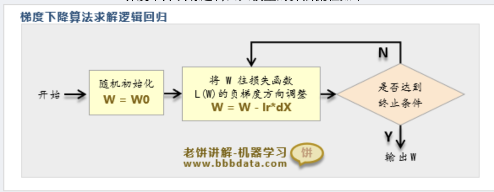

- [模型与算法](#模型与算法)
  - [1. 分类回归模型](#1-分类回归模型)
    - [1.1 线性模型](#11-线性模型)
      - [1.1.1 线性回归模型](#111-线性回归模型)
      - [1.1.2 岭回归模型](#112-岭回归模型)
      - [1.1.3 Lasso回归模型](#113-lasso回归模型)
    - [1.2 常用二分类模型](#12-常用二分类模型)
      - [1.2.1逻辑回归模型](#121逻辑回归模型)
      - [1.2.2决策树CART决策树](#122决策树cart决策树)
      - [1.2.3决策树ID3算法](#123决策树id3算法)
      - [1.2.4决策C4.5算法](#124决策c45算法)
    - [1.3 集成学习模型](#13-集成学习模型)
      - [1.3.1 随机森林](#131-随机森林)
      - [1.3.2 Adaboost](#132-adaboost)
      - [1.3.3 GBDT集成算法](#133-gbdt集成算法)
    - [1.4 其他模型](#14-其他模型)
      - [1.4.1 SVM支持向量机](#141-svm支持向量机)
      - [1.4.2 感知机二分类模型](#142-感知机二分类模型)
      - [1.4.3 朴素贝叶斯模型](#143-朴素贝叶斯模型)
  - [2. 过拟合和预防过拟合](#2-过拟合和预防过拟合)
    - [2.1 过拟合](#21-过拟合)
    - [2.2 预防过拟合](#22-预防过拟合)
  - [3. 模型评估](#3-模型评估)
    - [3.1 信息熵](#31-信息熵)
    - [3.2 评估指标](#32-评估指标)
- [降维与聚类](#降维与聚类)
  - [1.聚类算法](#1聚类算法)
    - [1.1 K-means聚类](#11-k-means聚类)
    - [1.2 DBSCAN聚类](#12-dbscan聚类)
    - [1.3 层次聚类](#13-层次聚类)
    - [1.4 Kohonen聚类](#14-kohonen聚类)
    - [1.5.实现算法](#15实现算法)
  - [2.降维算法](#2降维算法)
    - [2.1 SVD降维](#21-svd降维)
    - [2.2 PCA主成分分析](#22-pca主成分分析)
    - [2.3 LDA线性判别分析](#23-lda线性判别分析)
    - [2.4 FA因子分析](#24-fa因子分析)
    - [2.5 Fisher-LDA算法](#25-fisher-lda算法)
- [训练与求解](#训练与求解)
  - [1.求解算法](#1求解算法)
    - [1.1 最小二乘法](#11-最小二乘法)
    - [1.2 最小二乘和QA分解](#12-最小二乘和qa分解)
    - [1.3 广义特征值分解](#13-广义特征值分解)
  - [2.优化算法](#2优化算法)
    - [2.1 梯度下降法](#21-梯度下降法)
    - [2.2 牛顿法](#22-牛顿法)
    - [2.3 动量梯度下降法](#23-动量梯度下降法)
    - [2.4 自适应梯度下降法](#24-自适应梯度下降法)
    - [2.5 坐标梯度下降法](#25-坐标梯度下降法)

# 
模型与算法

## 1. 分类回归模型

### 1.1 线性模型

#### 1.1.1 线性回归模型 

具体内容看stata内容和笔记

#### 1.1.2 岭回归模型 

具体内容看stata内容和笔记

#### 1.1.3 Lasso回归模型 

具体内容看stata内容和笔记

### 1.2 常用二分类模型

#### 1.2.1逻辑回归模型

逻辑回归模型主要食用于二分类问题，其采用回归与概率的关系，这里的概率是指被处理的概率，最终形成一个logistic函数。然后采用极大似然函数，进行梯度下降法进行求解。具体可看stata order.（其中Ir为下降系数，自己定）***这个和回归不同，回归系数是e次方***

    
    
梯度下降法

#### 1.2.2决策树CART决策树

决策树模型（Decision Tree）是机器学习中最常用的模型之一，它可用于分类，也可用于回归

#### 1.2.3决策树ID3算法
#### 1.2.4决策C4.5算法

### 1.3 集成学习模型
#### 1.3.1 随机森林
#### 1.3.2 Adaboost
#### 1.3.3 GBDT集成算法

### 1.4 其他模型
#### 1.4.1 SVM支持向量机
#### 1.4.2 感知机二分类模型
#### 1.4.3 朴素贝叶斯模型

## 2. 过拟合和预防过拟合
### 2.1 过拟合
### 2.2 预防过拟合

## 3. 模型评估
### 3.1 信息熵
### 3.2 评估指标

# 
降维与聚类

## 1.聚类算法
### 1.1 K-means聚类
### 1.2 DBSCAN聚类
### 1.3 层次聚类
### 1.4 Kohonen聚类
### 1.5.实现算法

## 2.降维算法
### 2.1 SVD降维
### 2.2 PCA主成分分析
### 2.3 LDA线性判别分析
### 2.4 FA因子分析
### 2.5 Fisher-LDA算法

# 
训练与求解

## 1.求解算法
### 1.1 最小二乘法
### 1.2 最小二乘和QA分解
### 1.3 广义特征值分解

## 2.优化算法
### 2.1 梯度下降法
### 2.2 牛顿法
### 2.3 动量梯度下降法
### 2.4 自适应梯度下降法
### 2.5 坐标梯度下降法