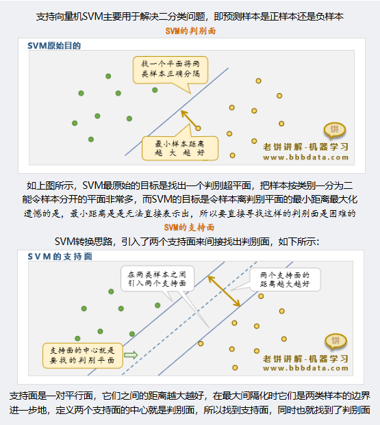
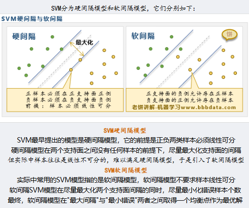
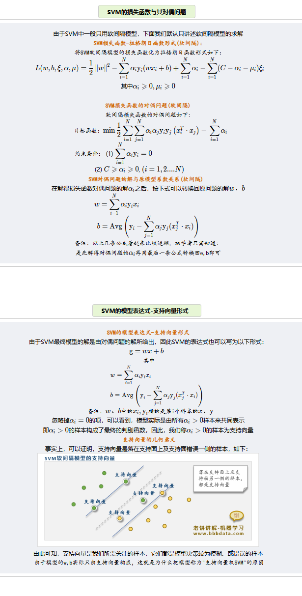
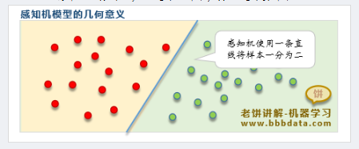
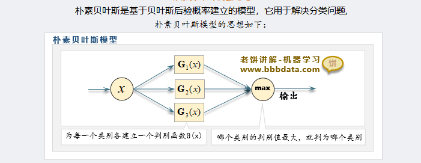
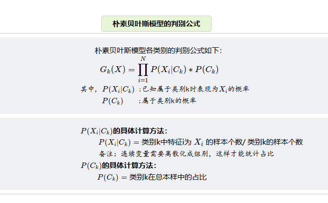
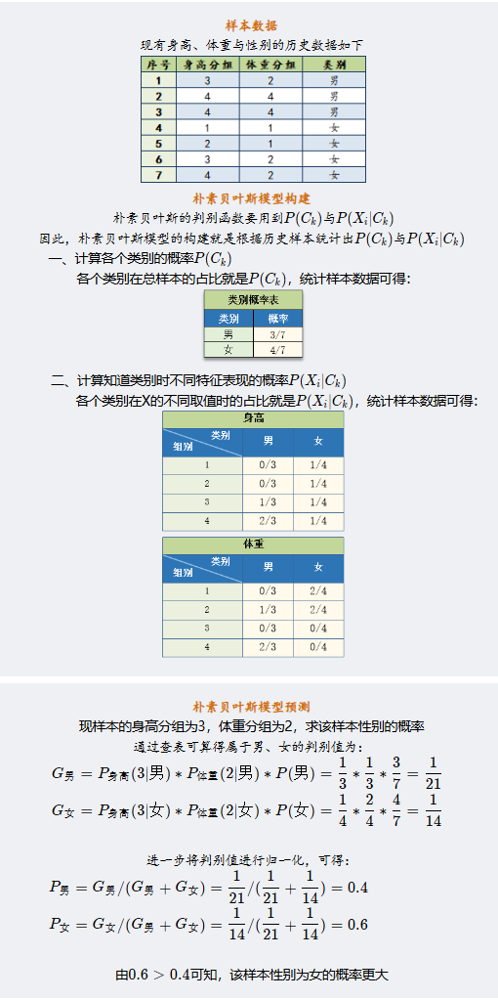

<!-- 封面样式 -->
<style>
@page {
    size: A4;
    margin: 20mm;
}
body {
    font-family: Arial, sans-serif;
    font-size: 14pt;
    line-height: 1.5;
}
.cover-page {
    display: flex;
    flex-direction: column;
    justify-content: center;
    align-items: center;
    height: 100vh;
    text-align: center;
}
.cover-title {
    font-size: 36pt;
    font-weight: bold;
    margin-bottom: 20px;
}
.cover-subtitle {
    font-size: 24pt;
    margin-bottom: 40px;
}
.cover-author {
    font-size: 18pt;
    margin-bottom: 20px;
}
.cover-date {
    font-size: 16pt;
}
</style>

<!-- 封面内容 -->
<div class="cover-page">
    <div class="cover-title">机器学习的实证方法与R代码</div>
    <div class="cover-subtitle">The Empirical Method of Economic Research and R Code</div>
    <div class="cover-author">作者:Laiqi Song</div>
    <div class="cover-date">日期: 2024年12月5日</div>
    <p style="text-align:center;"><span style="font-weight:bold;color:red;background-color: yellow">每个代码都得自己找代码跑一遍</span></p> 
</div>

- [模型与算法](#模型与算法)
  - [1. 分类回归模型](#1-分类回归模型)
    - [1.1 线性模型](#11-线性模型)
      - [1.1.1 线性回归模型](#111-线性回归模型)
      - [1.1.2 岭回归模型](#112-岭回归模型)
      - [1.1.3 Lasso回归模型](#113-lasso回归模型)
    - [1.2 常用二分类模型](#12-常用二分类模型)
      - [1.2.1逻辑回归模型](#121逻辑回归模型)
      - [1.2.2决策树CART决策树](#122决策树cart决策树)
      - [1.2.3决策树ID3算法](#123决策树id3算法)
      - [1.2.4决策C4.5算法](#124决策c45算法)
    - [1.3 集成学习模型](#13-集成学习模型)
      - [1.3.1 随机森林](#131-随机森林)
      - [1.3.2 Adaboost](#132-adaboost)
      - [1.3.3 GBDT集成算法](#133-gbdt集成算法)
      - [1.3.4 XGBoost集成算法](#134-xgboost集成算法)
    - [1.4 其他模型](#14-其他模型)
      - [1.4.1 SVM支持向量机](#141-svm支持向量机)
      - [1.4.2 感知机二分类模型](#142-感知机二分类模型)
      - [1.4.3 朴素贝叶斯模型](#143-朴素贝叶斯模型)
  - [2. 过拟合和预防过拟合](#2-过拟合和预防过拟合)
    - [2.1 过拟合](#21-过拟合)
    - [2.2 预防过拟合](#22-预防过拟合)
  - [3. 模型评估](#3-模型评估)
    - [3.1 信息熵](#31-信息熵)
    - [3.2 评估指标](#32-评估指标)
- [降维与聚类](#降维与聚类)
  - [1.聚类算法](#1聚类算法)
    - [1.1 K-means聚类](#11-k-means聚类)
    - [1.2 DBSCAN聚类](#12-dbscan聚类)
    - [1.3 层次聚类](#13-层次聚类)
    - [1.4 Kohonen聚类](#14-kohonen聚类)
    - [1.5.实现算法](#15实现算法)
  - [2.降维算法](#2降维算法)
    - [2.1 SVD降维](#21-svd降维)
    - [2.2 PCA主成分分析](#22-pca主成分分析)
    - [2.3 LDA线性判别分析](#23-lda线性判别分析)
    - [2.4 FA因子分析](#24-fa因子分析)
    - [2.5 Fisher-LDA算法](#25-fisher-lda算法)
- [训练与求解](#训练与求解)
  - [1.求解算法](#1求解算法)
    - [1.1 最小二乘法](#11-最小二乘法)
    - [1.2 最小二乘和QA分解](#12-最小二乘和qa分解)
    - [1.3 广义特征值分解](#13-广义特征值分解)
  - [2.优化算法](#2优化算法)
    - [2.1 梯度下降法](#21-梯度下降法)
    - [2.2 牛顿法](#22-牛顿法)
    - [2.3 动量梯度下降法](#23-动量梯度下降法)
    - [2.4 自适应梯度下降法](#24-自适应梯度下降法)
    - [2.5 坐标梯度下降法](#25-坐标梯度下降法)

<div style="page-break-after: always;"></div>

# <div align="center">模型与算法</div>

[内容来源](https://www.bbbdata.com/text/597)

## 1. 分类回归模型

### 1.1 线性模型

#### 1.1.1 线性回归模型

具体内容看stata内容和笔记

#### 1.1.2 岭回归模型

具体内容看stata内容和笔记

#### 1.1.3 Lasso回归模型

具体内容看stata内容和笔记

### 1.2 常用二分类模型

#### 1.2.1逻辑回归模型

逻辑回归模型主要食用于二分类问题，其采用回归与概率的关系，这里的概率是指被处理的概率，最终形成一个logistic函数。然后采用极大似然函数，进行梯度下降法进行求解。具体可看stata order.（其中Ir为下降系数，自己定）***这个和回归不同，回归系数是e次方***

<div align="center">
    
    <p style="font-size:18px;">梯度下降法</p>
</div>

#### 1.2.2决策树CART决策树

[例子加代码1](https://blog.csdn.net/lyc2016012170/article/details/122678079)
[例子加代码2](https://www.cnblogs.com/zhchoutai/p/7191728.html)
决策树模型（Decision Tree）是机器学习中最常用的模型之一，它可用于分类，也可用于回归。是一棵二叉树，且只支持数值变量。***<font color=green>特别地，当决策树用于回归时，则可以将决策树理解为一个分段函数</font>***
**CART决策树在构建时，每次选择一个变量与切割点将样本一分为二，得到左右两个节点左节点与右节点作为子节点继续各自生长、分裂，直到满足条件则停止生长，完成构建。一个特征不止可以使用一次**
决策树构建的目标就是构建出一棵树，使得历史样本在决策树上分类尽量准确

***叶子节点就是分类结果，子节点就是除根节点之外的节点***

***步骤***：

1. 初始化一个根节点                                  
2. 对非叶子节点进行分枝：
    对非叶子节点选择一个变量与一个分割值，将样本一分为二，得到左右两个节点
    并判断左右两个节点是否满足成为叶子节点的条件（**基尼系数混乱程度**），如果满足，则标上节点的预测值
3. 重复2，直到所有节点都成为叶子节点

***<font color=red>更加简单的决策树的构建过程如下：</font>***

1. 首先从开始位置，将所有数据划分到一个节点，即根节点。
2. 若数据为空集，跳出循环。如果该节点是根节点，返回null；如果该节点是中间节点，将该节点标记为训练数据中类别最多的类
  若样本都属于同一类，跳出循环，节点标记为该类别；
3. 如果经过橙色标记的判断条件都没有跳出循环，则考虑对该节点进行划分。既然是算法，则不能随意的进行划分，要讲究效率和精度，选择当前条件下的最优属性划分。
4. 经历上步骤划分后，生成新的节点，然后循环判断条件，不断生成新的分支节点，直到所有节点都跳出循环。

<div align="center">
    
    <p style="font-size:18px;">决策树生成</p>
</div>

<div align="center">
    
    <p style="font-size:18px;">决策树</p>
</div>

***问题与解答***：

1. ***分裂时如何选择变量与分割值：***
历遍所有的【变量-分割值】组合，哪种分割最优，就选择哪种【变量-分割值】
分类树判断【变量-分割值】的分割质量时的评估函数为：基尼函数，信息增益(熵)函数
回归树判断【变量-分割值】的分割质量时的评估函数为：平方差函数
1. ***叶子节点的预测值如何确定：***
对于分类树：叶子节点上的样本，哪个类别最多，就作为叶子节点的预测类别
对于回归树：取叶子节点上样本y值的平均值，作为叶子节点的预测值

***CART决策树节点分支的评估函数：***

1. ***分类树：基尼系数***--越低越好，前后比较
   GINI函数代表分裂后，在左(或右)节点随机抽取两个样本，它们类别不同的概率Gini函数的表达式如下：k表示类别
    $$Gini(t) = (\frac{N_L}{N}*[1 - \sum_{i=1}^{k}p_{ileft}^2]+\frac{N_R}{N}*[1 - \sum_{i=1}^{k}p_{iright}^2])$$
2. ***信息增益函数***--越低越好，前后比较
   信息增益函数代表分裂后，在左(或右)节点随机抽取两个样本，它们类别不同的概率信息增益函数的表达式如下：
    $$Gain(t) = -(\frac{N_L}{N}*\sum_{i=1}^{k}p_{ileft}log_2(p_{ileft})+\frac{N_R}{N}*\sum_{i=1}^{k}p_{iright}log_2(p_{iright}))$$
3. ***回归树：平方差函数***
   平方差函数代表分裂后，在左(或右)节点随机抽取两个样本，它们y值的差异平方差函数的表达式如下：
    $$G(t) = \sum_{i=1}^{N_L}(y_i - \bar{y}_L)^2+\sum_{i=1}^{N_R}(y_i - \bar{y}_R)^2$$
***<p style="text-align:center;"><span style="font-weight:bold;color:red;background-color: yellow"> 用信息增益或者使用信息增益比进行分枝。</span></p>***
***CART决策树的剪枝策略：***

1. **预剪枝**：在sklearn中就是调参数
2. **后剪枝**：一般使用CCP函数
   $$L = \sum_{t=1}^{T}\frac{N_i}{N}L_i + \alpha|T|$$
  在sklearn中，criterion设为entropy时，Li是第i个叶子的熵
  criterion设为GINI时，则是第i个叶子的GINI系数
  其中的参数为复杂度，用于惩罚子节点个数T。***因此不同的惩罚系数和代价与树的复杂度之间权衡。***

```python
# -*- coding: utf-8 -*-
from sklearn.datasets import load_iris
from sklearn import tree
import numpy as np
#----------------数据准备----------------------------
iris = load_iris()                                                    # 加载数据
X = iris.data                                                         # 用于训练的X
y = iris.target                                                       # 用于训练的y
#---------------模型训练--------------------------------- 
clf = tree.DecisionTreeClassifier(min_samples_split=10,ccp_alpha=0)   # 初始化决策树模型,这里设置min_samples_split就是一种预剪枝策略    
clf = clf.fit(X, y)                                                   # 训练决策树
pruning_path = clf.cost_complexity_pruning_path(X, y)                 # 计算CCP路径
#-------打印结果---------------------------    
print("\n====CCP路径=================")                               # 打印CCP路径
print("ccp_alphas:",pruning_path['ccp_alphas'])                       # 打印CCP路径中的alpha
print("impurities:",pruning_path['impurities'])                       # 打印CCP路径alpha对应的不纯度
```

#### 1.2.3决策树ID3算法

ID3主要使用**信息增益**来进行节点判定的选择。
其主要流程为：

1. 计算各个变量的信息增益,确定本次由哪个变量分支、
2. 对变量分支后,确定哪些节点是叶子节点
  哪些需要再分，需要再分的就继续由剩余变量分支
3. 如果所有节点都不需分支,或所有变量已分完,则停止算法.

***缺点：***
ID3算法的缺点如下：

  1. 变量偏好多枚举值
  2. ID3容易过拟合
  3. ID3不支持连续变量
  4. 不支持数据有缺失值

#### 1.2.4决策C4.5算法

C4.5算法是ID3算法的改进版，主要是解决ID3算法的缺点。
***纠正：***

  1. 变量偏好多枚举值--变量偏好纠正：使用信息增益比
  2. ID3容易过拟合--C4.5在ID3的基础上，加入了剪枝，来处理过拟合的问题。
  3. ID3不支持连续变量--在变量相邻值中间切割（n-1个割点，每个割点将变量割成两类
  4. 不支持数据有缺失值--最好忽略

### 1.3 集成学习模型

#### 1.3.1 随机森林

<div align="center">
    
    <p style="font-size:18px;">Bagging and Boosting</p>
</div>

随机森林(Random Forest)是bagging集成算法的一种实现，它集成多棵Cart决策树来共同决策。（Bagging指得是一种涉及在数据的随机子集上独立训练多个模型，并通过投票或平均聚合他们的预测）

随机森是通过随机抽取**不同样本**、不同的变量来训练出**多棵弱决策树**的，所以称为随机森林
随机森林的模型表达式为：
$$f(x) = \frac{1}{N}\sum_{i=1}^{N}f_i(x)$$
其中$f_i(x)$为第i棵树的预测值
***随机森林是如何Bagging:***

1. **随机样本**：使用boostrap抽样来使样本差异化，令每次训练的模型侧重点不一样 
 boostrap抽样指的是放回式抽样n次(n是整体样本个数)
1. **随机变量：** 每次**只随机抽取部分变量**来训练Cart决策树，削弱决策树的拟合能力这样既可以使每棵树使用的变量不一样，同时又能限制树的深度

<div align="center">
    
    <p style="font-size:18px;">随机森林</p>
</div>

***随机森林的模型评估***

由于bootstrap抽样，每个模型进行训练的数据都不是全部数据，而是漏出了大约33%的数据未使用，这部分数据可以用来评估模型的性能，这部分数据称为OOB(out of bag)数据。（袋外数据）
***用没有训练该数据的模型进行训练。最后的袋外得分就是对于所有模型的袋外预测的准确性的加权平均***

```python
"""
用于展示如何使用sklearn实现随机森林模型
r 代码见文件
"""
from sklearn.datasets import load_iris
from sklearn.ensemble import RandomForestClassifier
import numpy as np

np.random.seed(888)
#----------加载数据---------------                                          
iris = load_iris()                                                           # 加载iris数据
X    = iris.data                                                             # 样本的X
y    = iris.target                                                           # 样本的y

#------模型训练与预测---------------
clf = RandomForestClassifier(oob_score=True,max_features=2,n_estimators=100) # 初始化随机森林模型
clf.fit(X, y)                                                                # 训练随机森林模型
pred_prob = clf.predict_proba(X)                                             # 预测样本的概率
pred_c    = clf.predict(X)                                                   # 预测样本的类别
preds     = iris.target_names[pred_c]

#-------打印结果 ---------------
print("\n----前5个样本的真实类别:----") 
print(iris.target[0:5])
print("\n----前5个样本的预测结果:----") 
print(pred_c[0:5])
print("\n----袋外准确率oob_score:----") 
print(clf.oob_score_)
print("\n----特征得分:----") 
print(clf.feature_importances_)
```

#### 1.3.2 Adaboost

[例子](https://zhuanlan.zhihu.com/p/41536315)
***介绍：*** 弱分类器就是单层决策树,***<font color=deep>弱分类器由CART生成</font>***
AdaBoost以Boosting方式集成多个弱二分类模型来产生泛化能力好、预测精度高的**强二分类模型**，其模型为：
$$f(x) = \sum_{i=1}^{N}\alpha_if_i(x)$$ 其中$\alpha$为决策器的权重，$f_i(x)$为第i个决策器的预测值，每个$f_i(x)$输出为（-1，1）
以 ***<font color=green>Cart分类树作为决策器</font>***，此时，则称为 **AdaBoost提升树**
**总失函数为：**
$$L = \sum_{i=1}^{N} e^{(-y_if(x_i))}$$损失函数用的是指数损失函数
**第k个决策器的损失函数为：**
$$L_k = \sum_{i=1}^{N} e^{(-y_if_k(x_i))}$$其中k为前k个决策器

***算法思想：***

1. 初始化样本权重分布，使得每个样本的权重相等、
2. 训练第一个分类器进行分类，对于分类正确的在下一次降低权值，分类错误的增加权值进行下次分类，直到最后误差率为0。（每个分类器分类的特征可以不一样）
3. 最后，组合所有的分类器，得到强分类器，加权组合。

***模型训练：*** Adaboost采用前向分步算法训练，即在已有决策器的基础上逐个添加新的决策器，每个决策器都力求损失函数最小化，直到新增决策器无法降低损失函数则停止训练。

<div align="center">
    
    <p style="font-size:18px;">adaboost方式</p>
</div>

1. 决策器样本权重（***决策器已经存在***）
   每个决策器都以不同的样本权重进行训练，样本中有多个值，不停更新权重，调整预测。在第一次训练，对于每个样本点都设置一个初始权重$1/N$。
2. 选取一个当前***误差率最低***的弱分类器作为一个基本分类器。误差计算公式为：
    $$e_k = \frac{\sum_{i=1}^{N}w_iI(y_i \neq f_k(x_i))}{\sum_{i=1}^{N}w_i}$$
3. 计算权重：这里的权重的表达式其实就是损失函数的驻点
    $$\alpha_k = \frac{1}{2}ln(\frac{1-e_k}{e_k})$$
4. 更新样本权重：
  $$w_{i+1} = w_i * e^{(-\alpha_ky_if_k(x_i))}$$
  这里实际上加大对错误的样本权重，从而降低误差率，这里用的损失函数。权重其实也是损失函数的简化。最后选择**误差率最低**的分类器以达到**误差最小。**
    $$w_{i+1} =
    \begin{cases}
    w_ie^{\alpha_k}, & y_i = f_k(x_i)\\
    w_ie^{-\alpha_k}, & y_i \neq f_k(x_i)
    \end{cases}$$
5. 继续重复从第2步，直到达到指定的弱分类器数目或者达到指定的误差率。最后组合，最后使用一个分段函数进行判定。

[仔细求导的网址](https://blog.csdn.net/wzk4869/article/details/126528516)

***<p style="text-align:center;"><span style="font-weight:bold;color:red;background-color: yellow"> 最终实际上是通过对样本训练得到的弱分类器的权重，来组合得到一个强分类器。</span></p>***

```python
# -*- coding: utf-8 -*-
import matplotlib.pyplot as plt
from sklearn.ensemble import AdaBoostClassifier
from sklearn.tree import DecisionTreeClassifier
from sklearn.datasets import make_gaussian_quantiles
import matplotlib
matplotlib.use('TkAgg')#没这两行出大问题
# --------------- 数据生成 -------------------
# 生成2维正态分布，生成的数据按分位数分为两类，500个样本,2个样本特征，协方差系数为2
X, y = make_gaussian_quantiles(cov=2.0,n_samples=500, n_features=2,n_classes=2, random_state=1)   # 生成训练样本数据


# --------------- 模型训练与预测 -------------------
base_clf = DecisionTreeClassifier(max_depth=2, min_samples_split=20, min_samples_leaf=5)           # 初始化决策树作为决策器
clf      = AdaBoostClassifier(base_clf,algorithm="SAMME",n_estimators=50, learning_rate=0.8)       # 初始化AdaBoost
clf.fit(X, y)                          # 模型训练
pred  = clf.predict(X)                     # 模型预测的类别
proba = clf.predict_proba(X)                     # 模型预测的概率

# ----------------- 打印结果-------------------------
fig, axes = plt.subplots(2, 1,figsize=(10, 6))           # 初始化画布
plt.subplots_adjust(wspace=0.2, hspace=0.3)          # 调整画布子图间隔
axes[0].scatter(X[:, 0], X[:, 1], c=y)               # 画出样本与真实类别
axes[0].set_title('sample-true-class')              # 设置第一个子图的标题
axes[1].scatter(X[:, 0], X[:, 1], c=pred)    # 画出样本与预测类别
axes[1].set_title('sample-predict-class') # 设置第二个子图的标题
plt.show()    
# 显示画布
																								   
print("\n----前10个样本预测结果-----:\n",proba[1:10,1]) # 打印前10个样本的预测值
print("\n---各个决策器的权重系数----:\n",clf.estimator_weights_)     # 打印决策器权重
```

#### 1.3.3 GBDT集成算法

[简单易懂的例子](https://blog.csdn.net/ShowMeAI/article/details/123402422)
***介绍：***
GBDT梯度提升树，是一种专门用于解决二分类问题的Boosting集成算法
它集成的是CART回归树，且以样本预测值的损失梯度作为拟合残差，因此称为GBDT梯度提升树。
GBDT由多棵弱回归树构成，经过学习率lr与阈值b调整后得到样本类别的判别值
一方面它利用了弱回归树的泛化能力，另一方面通过多棵回归树来逐步加强模型的预测精度，表达式如下:
$$f(x) = lr\sum_{i=1}^{N}f_i(x)+b$$其中g为判别值，大于0为正类别，小于0为负类别

***损失函数：*** 对数似然损失函数,回归树用平方误差损失函数，***如果是平方差，那么其梯度就是参数的线性变化，所以可以用负梯度作为近似值***
$$L = \sum_{i=1}^{N}[ln(1+e^{f(x_i)})-y_if_i]$$

***训练思想：***
GBDT采用前向分步算法训练，就先直接训练一棵树的基础上，再逐个添加新的回归树。<font color=red>*（本模型用的是梯度下降，而梯度提升也是负梯度，但是在函数空间，不需要再次计算）</font>*

<div align="center">
    
    <p style="font-size:18px;">GBDT训练思想</p>
</div>

由于其函数是g的函数，用g进行梯度下降进行计算。实际上是用 **<font color=Blue>梯度</font>** 近似 **<font color=red>残差</font>**
**由于其自变量是预测值，通过移动预测值进行梯度下降。**

***GBDT的训练流程：***

<div align="center">
    
    <p style="font-size:18px;">GBDT流程图</p>
</div>

1. 首先自己找一个值（递归）找到mse最小的值
2. 计算本次回归树每个样本的拟合值(即残差)
   此时用梯度代替残差
3. 用上述残差作为每个样本的目标预测值，训练弱回归树
   用残差作为实际值进行预测，利用其他的特征即训练棵新树，知道残差最小满足条件。
4. 优化弱回归树的叶子节点，相当于换成残差加上上个模型的预测值

```python
# -*- coding: utf-8 -*-
"""
本代码展示一个调用sklearn包实现GBDT梯度提升树的Demo
本代码来自《老饼讲解-机器学习》www.bbbdata.com
"""
import matplotlib.pyplot as plt
from sklearn.datasets import make_gaussian_quantiles
from sklearn.ensemble import GradientBoostingClassifier

# --------------- 数据生成 -------------------
# 生成2维正态分布，生成的数据按分位数分为两类，500个样本,2个样本特征，协方差系数为2
X, y = make_gaussian_quantiles(cov=2.0,n_samples=500, n_features=2,n_classes=2, random_state=1)  # 生成训练样本数据

#--------------模型训练与预测---------------------
clf = GradientBoostingClassifier(n_estimators=100,learning_rate=0.1,random_state=0)              # 初始化GBDT模型
clf.fit(X, y)                        # 模型训练
pred  = clf.predict(X)         # 模型预测的类别
proba = clf.predict_proba(X)        # 模型预测的概率

# ----------------- 打印结果-------------------------
fig, axes = plt.subplots(2, 1,figsize=(10, 6))            # 初始化画布
plt.subplots_adjust(wspace=0.2, hspace=0.3)               # 调整画布子图间隔
axes[0].scatter(X[:, 0], X[:, 1], c=y)      # 画出样本与真实类别
axes[0].set_title('sample-true-class')            # 设置第一个子图的标题
axes[1].scatter(X[:, 0], X[:, 1], c=pred)       # 画出样本与预测类别
axes[1].set_title('sample-predict-class')               # 设置第二个子图的标题
plt.show()           # 显示画布
print("\n----前10个样本预测结果-----:\n",proba[1:10,1])      # 打印前10个样本的预测值
```

#### 1.3.4 XGBoost集成算法

[代码与例子](https://blog.csdn.net/weixin_47723732/article/details/122870062)<font color=red>其中有很多很好的代码学习</font>
XGBoost是一种集成学习算法，它是GBDT的一种**改进版**，主要是解决GBDT的计算效率问题。通过引入正则项来限制树的深度以及数量。

***训练思想：***
利用残差进行训练，与GBDT类似，同时使用CART生成树，但是在生成树的时候，引入了正则项，来限制树的深度和数量，从而提高模型的泛化能力。其他基本差不多

***XGBoost的损失函数：*** 若是回归则用平方误差，若是分类则用对数似然损失函数
$$L = \sum_{i=1}^{N}[ln(1+e^{f(x_i)})-y_if_i] + \gamma T + \frac{1}{2}\lambda||w||^2$$
叶子节点越多则误差越大，限制深度。

***XGBoost与GBDT的区别：***

1. **正则项：** XGBoost引入了正则项，来限制树的深度和数量，提高模型的泛化能力
2. **泰勒展开：** XGBoost使用了泰勒展开的二阶形式，GBDT利用一阶泰勒展开。
3. **数据采样：** XGBoost支持bootstrap采样，可以提高模型的泛化能力
4. **支持多种基学习器：** XGBoost支持多种基学习器，如线性分类器、决策树等
5. **缺失值处理：** XGBoost支持缺失值处理，可以自动学习处理缺失值的策略

### 1.4 其他模型

#### 1.4.1 SVM支持向量机

**1.感知机SVM介绍**
支持向量机SVM主要用于解决二分类问题，即预测样本是正样本还是负样本。
<font color=red>前提是样本一定可分</font>
***<font color=green>当样本线性不可分时，就需要通过核函数进行映射，将其映射到高维进行区分。</font>***

<div align="center">
    
    <p style="font-size:18px;">支持向量机图示</p>
</div>

***软间隔与硬间隔：***
<div align="center">
    
    <p style="font-size:18px;">软间隔与硬间隔</p>
</div>

**2.感知机SVM表达式**

支持向量机的判别面、支持面是三个平行面，因此它们的数学表示为：
支持面$：w*x+b=+-1 $
判别面：$wx+b=0$
进一步可得，判别面与支持面的距离为：$d = \frac{1}{||w||}$

在应用SVM模型时，使用的是SVM的判别函数:
g=wx+b 代表样本距离支持面是多少d
当判别式g>=0时，样本属于正样本，否则属于负样本

***损失函数为：***
由于SVM的支持面与判别面的距离为$d = \frac{1}{||w||}$，所以两个支持面的距离为$2d = \frac{2}{||w||}$，最大化两支持面之间的距离 $\frac{2}{||w||}$,等于最小化其倒数

对于**硬间隔**，要求所有样本在支持面之外：
$min \quad \frac{1}{2}||w||^2$
约束条件：$y_i(wx_i+b)>=1$

对于**软间隔**，允许部分样本在支持面之内：
$min \quad \frac{1}{2}||w||^2 + C\sum_{i=1}^{N}\xi_i$
约束条件：$y_i(wx_i+b)>=1-\xi_i$
其中C为惩罚系数，其极小时就是硬间隔

**3.感知机SVM求解**
<div align="center">
    
    <p style="font-size:18px;">SVM的求解</p>
</div>
<div align="center">
    
    <p style="font-size:18px;">求解细节SVM</p>
</div>

**4.感知机SVM代码**

```python
from sklearn import svm
import numpy as np

# ----生成样本数据与构建SVM模型-----------
X = np.array( [[0.708333,1],[0.291667,1],[0.217,1.5],[0.2367,0.3],[0.454,1]
               ,[0.583333,-4],[0.875,-1],[0.333,-0.6],[0.111,-1]] )
y = np.array([1,1,1,1,1,-1,-1,-1,-1])
clf = svm.SVC(kernel ='linear',C=1000)             # 初始SVM模型，这里C设为很大,也就成为了硬间隔
clf.fit(X,y)                                       # 用X,y训练模型

# -----------------打印模型系数------------
print('\n---------支持向量与alpha--------')        # 打印模型求解结果
print('support_vectors:\n',clf.support_vectors_)  # 打印支持向量
print('alpha:\n'  ,clf.dual_coef_[0])             # 打印支持向量系数

print("\n----------模型系数---------") 
w = clf.coef_                                     # 提取模型系数w,它等于clf.dual_coef_[0]@clf.support_vectors_
b = -clf._intercept_                              # 提取模型系数b
print('w:',w)                                     # 打印模型系数w
print('b:',b)                                     # 打印模型阈值b

 # ---画出分割面与支持面-----------------
import matplotlib.pyplot as plt
plt.rcParams["figure.figsize"] = (9, 5)           # 设置figure_size尺寸
plt.scatter(X[:, 0], X[:, 1],c=y,marker='o')      # 画出样本点  
line_x = np.array([X[:,0].min(),X[:,0].max()])    # 判别面的x坐标
line_y = (-b-w[0,0]*line_x)/w[0,1]                # 判别面的y坐标
plt.plot(line_x,line_y)                           # 画出判别面
line_u = (-b+1-w[0,0]*line_x)/w[0,1]              # 上支持面的y坐标
line_b = (-b-1-w[0,0]*line_x)/w[0,1]              # 下支持面的y坐标
plt.plot(line_x,line_u,color='grey')              # 画出上支持面
plt.plot(line_x,line_b,color='grey')              # 画出下支持面
```

#### 1.4.2 感知机二分类模型

**1.感知机模型**
感知机(perceptron)模型是一个线性模型，它主要用于做二分类
在输入为**二维**的时候，感知机就相当于找出一条**直线**
将平面一分为二，一边为**正样本**，另一边为**负样本**.
其数学表达式为：
$$f(x) = sign(w*x+b)$$
其中w为权重，b为偏置，sign为符号函数，x为输入样本，y=1为正样本，y=-1为负样本

<div align="center">
    
    <p style="font-size:18px;">感知机图示</p>
</div>

其损失函数,最小化误差E：
$$E = 1/n\sum_{i}^n \begin{cases}
  0, & sign(wx_i+b)= y_i \\
  1, & else\\
\end{cases}$$
变化为易于求导的形式：$$L = -\sum_{i}^n y_i(wx_i+b)$$

其实仔细分析即可以知道：当预测正确时，其L为正数，而预测错误时，其值必然为负数。

***<p style="text-align:center;"><span style="font-weight:bold;color:red;background-color: yellow">因此我们需要L越小越好，因此只需要往负梯度调整就好。</span></p>***

**2.感知机训练**
感知机***一般用单样本训练，即逐个样本训练w、b***。如果当前训练样本的预测值与真实值不一致，就往负梯度方向更新w，b。
感知机第i个样本的损失函数对 w 和 b 的梯度如下：
$$\frac{\partial L}{\partial w} = -y_ix_i \quad \frac{\partial L}{\partial b} = -y_i$$

具体训练：
1. 初始化w、b为0
2. 逐个样本训练w、b，如果训练样本的预测值与真实值不一致。则往负梯度方向更新w，b( 其中，lr为学习率)
$$w = w + lr*y_ix_i \quad b = b + lr*y_i$$
3. 检测是否终止训练，否则重复2，条件为:总体的误差达到目标，达到最大的训练步数。
4. 输出结果

**3.感知机模型-代码**

```python
from sklearn.linear_model import Perceptron
import numpy as np
# ----生成样本数据-----------
X = np.array( [[0,0],[0,1],[0.2,0.5],[1,0],[1,1],[0.8,0.3]] )
y = np.array([1,1,1,-1,-1,-1])

# -----训练感知机模型--------
clf = Perceptron(eta0=0.1,max_iter=10000)          # 初始化感知机模型,并设学习率为0.1
clf.fit(X,y)                                       # 训练感知机
y_pred = clf.predict(X)                            # 对样本进行预测
acc    = sum(y==y_pred )/len(y)                    # 统计准确率
w      = clf.coef_                                 # 提取模型权重
b      = clf.intercept_                            # 提取模型阈值

# -----打印结果---------------------              
print('\n模型准确率:',acc)                         # 打印准确率
print('模型权重w:',w)                              # 打印权重w
print('模型阈值b:',b)                              # 打印阈值b

# -----画出分割平面------------------
import matplotlib.pyplot as plt
plt.scatter(X[:, 0], X[:, 1],c=y,marker='o')       # 画出样本点  
line_x = np.array([X[:,0].min(),X[:,0].max()])     # 判别面的x坐标
line_y = (-b-w[0,0]*line_x)/w[0,1]                 # 判别面的y坐标
plt.plot(line_x,line_y)                            # 画出判别面
```

#### 1.4.3 朴素贝叶斯模型

**1. 朴素贝叶斯简介**
它通过历史数据，利用贝叶斯原理对每个类别各自建立一个判别公式$G_k(x)$模型预测时，分别用各个类别的判别公式进行预测，哪个判别值最大就判为哪个类别

<div align="center">
    
    <p style="font-size:18px;">朴素贝叶斯思想</p>
</div>

其公式类似于我们的全概率公式。其判别公式如下:

<div align="center">
    
    <p style="font-size:18px;">贝叶斯判别公式</p>
</div>

**2. 朴素贝叶斯模型原理**
贝叶斯原理就是全概率公式：
$$P(A|B) = \frac{P(B|A)P(A)}{P(B)}$$
更加容易的可以表现为特征和类别之间的关系：
$$P(属于类别k|已知表现为x特征) = \frac{P(已知表现为x特征|属于类别k)P(属于类别k)}{P(已知表现为x特征)}$$

若各个特征之间独立，那么狮子就可表现为：
$$P(属于类别k|已知表现为x特征) = \frac{\prod \limits_{i=0}^N P(已知表现为x特征|属于类别k)P(属于类别k)}{\prod \limits_{i=0}^N P(已知表现为x特征)}$$

**<font color=red>朴素贝叶斯中的"朴素"，指的就是"各特征间互相独立"这一条件**</font>

其判别公式为: 
$G_k(x)=\prod \limits_{i=0}^N P(已知表现为x特征|属于类别k)P(属于类别k)$

**关于朴素贝叶斯如何输出概率:** 
有时我们希望模型输出每个类别的具体概率，理论上，只需按(2)中的概率公式就能得到各类别的概率,但实际中往往会发现各类别的概率之和不为一，这是因为实际中各个特征$X_i$之间并不独立所造成的.因此，实际中如果需要输出概率，更一般的方法是直接将各类别的判别值$G_k(x)$进行归一化，作为概率值

**3. 朴素贝叶斯模型-例子讲解**

<div align="center">
    
    <p style="font-size:18px;">手算朴素贝叶斯</p>
</div>

**4. 代码实现**

```python
import numpy as np 
from sklearn import naive_bayes
from sklearn.datasets import load_iris


#----------------数据准备--------------
iris = load_iris()                            # 加载数据
X    = iris.data                              # 用于建模的X
y    = iris.target                            # 用于建模的y

#---------------模型训练----------------
clf = naive_bayes.GaussianNB()                # 初始化贝叶斯模型
clf = clf.fit(X,y)                            # 用数据训练树模型构建
#---------------模型预测----------------
y_pred = clf.predict(X)                       # 对样本进行预测
print("\n样本的真实类别:",y)                   # 打印样本的真实类别
print("样本的预测类别:",y_pred)                # 打印样本的预测类别
print("模型准确率:",(y_pred==y).mean())        # 打印准确率
```

## 2. 过拟合和预防过拟合
### 2.1 过拟合
### 2.2 预防过拟合

## 3. 模型评估
### 3.1 信息熵
### 3.2 评估指标

<div style="page-break-after: always;"></div>

# <div align="center">降维与聚类</div>
## 1.聚类算法
### 1.1 K-means聚类
### 1.2 DBSCAN聚类
### 1.3 层次聚类
### 1.4 Kohonen聚类
### 1.5.实现算法

## 2.降维算法
### 2.1 SVD降维
### 2.2 PCA主成分分析
### 2.3 LDA线性判别分析
### 2.4 FA因子分析
### 2.5 Fisher-LDA算法

<div style="page-break-after: always;"></div>

# <div align="center">训练与求解</div>
## 1.求解算法
### 1.1 最小二乘法
### 1.2 最小二乘和QA分解
### 1.3 广义特征值分解

## 2.优化算法
### 2.1 梯度下降法
### 2.2 牛顿法
### 2.3 动量梯度下降法
### 2.4 自适应梯度下降法
### 2.5 坐标梯度下降法